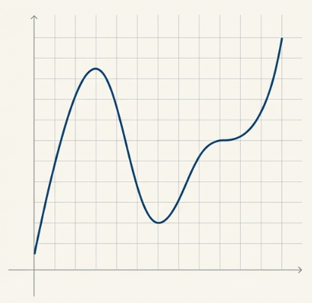
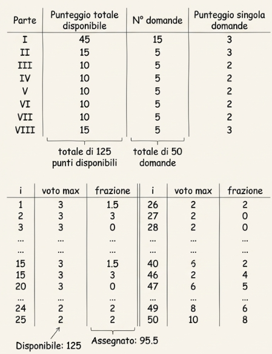
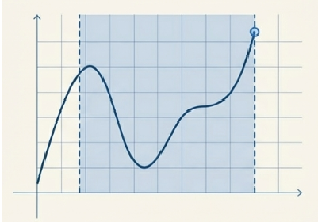
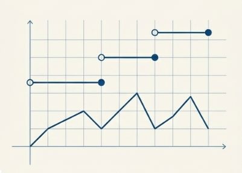

<!-- _class: titlepage -->

 Generazione di spazi di ricerca 

 Analisi tecnica della generazione di spazi di stati di dimensione intrattabile 

 Gabriele Brizio 

 Domanda 1.1 

 Algoritmi e Complessità 

---

## Il problema motivazionale: "Valutazioni"

Per capire perché dobbiamo generare uno spazio di ricerca, partiamo dal problema **Valutazioni**.

*   Obiettivo: Massimizzare il voto totale entro un limite (es. 100 punti).
*   Natura del problema: Dobbiamo scegliere un sottoinsieme di risposte.
*   Variabili: $x_i \in \{0, 1\}$ (Includo la risposta o no?).

> **Nota:** Non è un problema di calcolo su numeri reali, ma di scelta combinatoria.

---

## L'Illusione del Calcolo Classico

L'istinto matematico suggerirebbe di usare il **Calcolo Classico**.
Se potessimo esprimere il ricavo come una funzione continua $g(x)$, cercheremmo i punti di massimo azzerando la derivata prima:

$$ g'(x) = 0 $$

Le radici della derivata individuano punti stazionari (massimi/minimi relativi o flessi).

> Sembra promettente, ma è applicabile ai nostri problemi?

---

## Fallimento: i vincoli e gli estremi

Nei problemi reali (allocazione risorse), la funzione è definita su **intervalli limitati** (vincoli).

*   Il massimo assoluto spesso non è dove la derivata è zero, ma sugli **estremi dell'intervallo**.
*   Il calcolo classico trova solo i punti stazionari interni.

**Conseguenza:** Per trovare l'ottimo, dovremmo testare tutte le combinazioni di:
1. Radici delle derivate.
2. Estremi imposti dai vincoli.

---

# L'esplosione combinatoria (Intrattabilità)

Se provassimo ad applicare il metodo analitico "bruto" sui vincoli:

Immaginiamo di avere $N$ variabili (attività).
Se ogni variabile ha anche solo un intervallo (2 estremi) e la funzione ha qualche punto stazionario (es. 3), il numero di punti da verificare esplode secondo la formula:

$$ \text{Tentativi} \approx (3 + 2V)^N $$

*   $V$: numero vincoli.
*   $N$: numero variabili.

> Con $N=20$, i tentativi superano i **3 miliardi**. Il metodo analitico diventa intrattabile quanto una ricerca esaustiva.

---

## Discontinuità e variabili discrete

Il problema fondamentale è la natura delle variabili:
*   In *Valutazioni* o *Bando*, $x_i$ è **discreto** ($0$ o $1$).
*   Le funzioni risultanti sono "a scalino" o poligonali.
*   **Non sono derivabili** in molti punti.

Inoltre, se la funzione di ricavo è **Lineare** ($g(x) = ax$), la derivata è costante ($a$). Non esiste un "picco" da trovare con la derivata nulla: il massimo è sempre a un estremo.

---

# Perché non usare la Programmazione Lineare (PL)?

Potremmo pensare di usare la **PL** o la **PLI** (Intera).

1.  **PL (Programmazione Lineare):** Assume variabili reali $x_i \in \mathbb{R}$. Non garantisce soluzioni binarie $\{0,1\}$ necessarie per scegliere i progetti o le risposte.
2.  **PLI (Programmazione Lineare Intera):** Impone variabili intere, ma ricade nella stessa complessità computazionale: non potendo usare gradienti su spazi discreti, deve procedere per tentativi combinatori.

---

# La necessità dello spazio di ricerca

Poiché non esiste una "formula chiusa" (closed-form) per calcolare direttamente la soluzione ottima:

1.  Dobbiamo accettare di procedere per **tentativi**.
2.  L'insieme di tutti i possibili tentativi (tuple delle scelte $x_1, \dots, x_N$) costituisce lo **Spazio di Ricerca** (o Spazio degli Stati).
 

### La sfida:
Lo spazio ha dimensione $2^N$ (esponenziale).
Generarlo tutto è computazionalmente costoso (Intrattabile).

---

# La generazione dello spazio degli stati

Se non possiamo calcolare la soluzione con una formula (derivate),
dobbiamo **generare** e valutare le possibili configurazioni.

Si può vedere la soluzione ai problemi motivazionali (Valutazioni, Bando) come una **tupla** di decisioni.

*   Siano $x_1, \dots, x_N$ le variabili decisionali (attività).
*   Ogni variabile è discreta: $x_i \in \{0, 1\}$ (Scelta/Non scelta).

### Definizione:
Lo *spazio di ricerca* è l'insieme di tutte le possibili tuple $(x_1, \dots, x_N)$ che rappresentano un tentativo di allocazione delle risorse.

> "Le soluzioni assumono la forma di tuple $x^*_1, ..., x^*_N$, in cui ogni $x^*_i \in \{0, 1\}$." [1]

---

# Come si "genera" lo spazio?

Generare lo spazio significa enumerare le combinazioni. Poiché non abbiamo una funzione continua, procediamo per **tentativi discreti**.

Ogni tentativo è una combinazione di stati delle variabili:
1.  Fisso $x_1$ (0 o 1)
2.  Fisso $x_2$ (0 o 1)
3.  ...
4.  Fisso $x_N$ (0 o 1)

 

Questo processo sequenziale definisce la **struttura dello spazio degli stati**.

---

# Dimensione intrattabile

Un problema è **intrattabile** se il tempo necessario per esplorare lo spazio delle configurazioni cresce più rapidamente di qualunque funzione polinomiale del numero di variabili.

Esempi tipici:
- $2^n$: spazio dei sottoinsiemi  
- $n!$: spazio delle permutazioni  
- $n^k$: spazio delle disposizioni

L’intrattabilità non è un difetto implementativo, ma una **caratteristica strutturale del problema**.

---

# Generazione e visita

Per operare su problemi intrattabili spesso conviene dividere le fasi di generazione e visita dello spazio di ricerca.

Dobbiamo usare tecniche algoritmiche per:
1.  **Generare** lo spazio (un ramo alla volta).
2.  **Visitare** lo spazio.

Le tecniche per gestire questa generazione sono:
*   **Brute-Force:** Le genero tutte (impossibile per $N$ grandi).
*   **Backtracking:** Genero un ramo, se non va bene torno indietro.
*   **Branch & Bound:** Taglio intere parti dello spazio prima di generarle.

---

# Conclusione

In sintesi:

1.  Poiché le variabili sono discrete ($0/1$) e i vincoli complessi, il Calcolo Classico fallisce.
2.  Siamo costretti a definire uno spazio di ricerca composto da **tuple discrete**.
3.  La generazione di questo spazio avviene combinando i valori possibili delle variabili.
4.  Essendo la dimensione intrattabile, la generazione deve essere gestita da algoritmi intelligenti (Backtracking/B&B) che evitano l'enumerazione completa.
