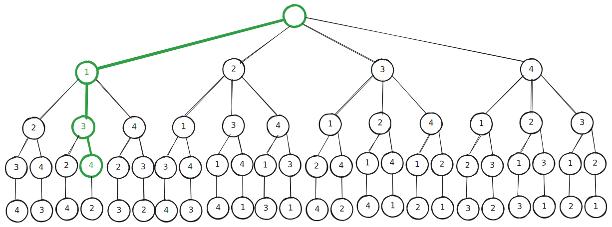
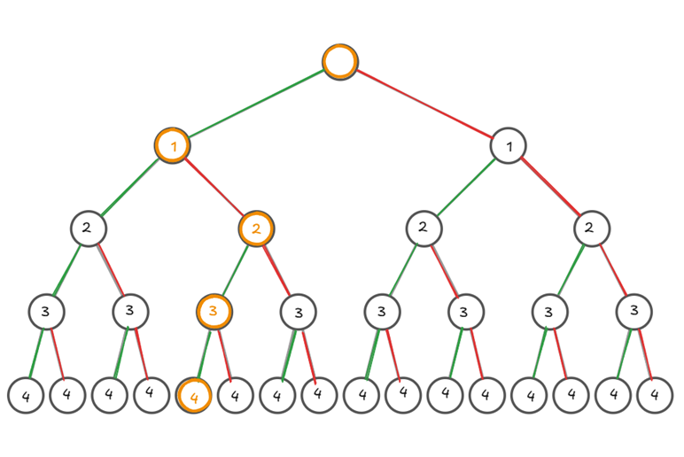

<!-- _class: titlepage -->

 Brute Force 

 La visita Brute-Force nella ricerca di risposte a problemi algoritmicamente intrattabili 

 Gabriele Brizio 

 Domanda 1.2 

 Algoritmi e Complessità 

---

# Introduzione teorica

La **visita Brute-Force** rappresenta il paradigma più generale e diretto per affrontare problemi in cui **non esistono algoritmi efficienti noti**.
 

 *Definizione:*  
 La visita Brute-Force consiste nell’esplorazione completa e sistematica di tutte le configurazioni possibili dello spazio degli stati, allo scopo di individuare una o più soluzioni ottimali.
 

Tale approccio garantisce **completezza** e **correttezza**, ma implica un alto costo computazionale.

---

# Contesto: problemi algoritmicamente intrattabili

Si definisce *intrattabile* un problema per cui non è noto alcun algoritmo con tempo di esecuzione polinomiale rispetto alla dimensione dell’input.

Esempi tipici:
- Problema dello zaino (Knapsack Problem)
- Problema del commesso viaggiatore (TSP)
- Problemi di assegnamento e valutazione combinatoria

Questi problemi richiedono di analizzare uno **spazio di ricerca** di dimensione $O(2^n)$ o $O(n!)$, dove ogni elemento rappresenta una possibile configurazione di decisioni.

---

# Principio di generazione e visita esaustiva

Il paradigma Brute-Force si basa su due operazioni fondamentali:

1. **Generazione**: costruzione di tutte le configurazioni possibili di variabili e vincoli.  
2. **Visita**: esplorazione sistematica di tali configurazioni, applicando una funzione di valutazione per identificare la soluzione ottima.

Formalmente:
$$
\text{Soluzione ottima} = \arg\max_{s \in S} f(s)
$$
dove $S$ è l’insieme di tutti gli stati generabili.

---

# Formalizzazione operativa

La visita Brute-Force è formalmente esprimibile come un **algoritmo iterativo di generazione e valutazione**. L’algoritmo deve poter generare, rappresentare e visitare ciascun elemento dello spazio.

<b>Pseudocodice generale</b>

    ALGORITHM BruteForce(S, f)
      best_state ← NULL
      max_value ← -∞

      FOR EACH state s IN S 
         current_val ← f(s)
         
         IF current_val > max_value THEN
               max_value ← current_val
               best_state ← s

      RETURN best_state
    

 

- $S$: spazio degli stati (insieme delle configurazioni)</li>

- $f(s)$: funzione obiettivo o di valutazione</li>

---

# Esempio di applicazione: Problema delle valutazioni

Istanza di esempio:

| Domanda   | Voto Max     | Voto assegnato  |
| --------- | ------------ | --------------- |
| 1         | 7            | 5.5             |
| 2         | 11           | 9.2             |
| 3         | 5            | 4.6             |
| 4         | 2            | 1.6             |
| Voto massimo assegnabile: 15             |

* Ogni combinazione di punteggi rappresenta una configurazione.
* Lo spazio di ricerca è costituito da tutte le possibili allocazioni.
* L’algoritmo visita ogni configurazione per calcolare il punteggio complessivo.

---

# Rappresentazione dello spazio come permutazioni

---

# Rappresentazione dello spazio come sottoinsiemi

* Ogni nodo rappresenta uno stato parziale.
* Ogni ramo una decisione binaria.
* Le foglie rappresentano le soluzioni complete. 
La visita Brute-Force esplora **tutti** i rami dell’albero, valutando ciascuna foglia.

---

# Complessità computazionale

La visita esaustiva garantisce l’individuazione della soluzione ottimale, ma al costo di una **complessità esponenziale**.

| Tipo di spazio | Complessità temporale | Esempi                        |
| -------------- | --------------------- | --------------------------- |
| Sottoinsiemi   | $O(2^n)$            | KP binario              |
| Permutazioni   | $O(n!)$             | TSP                     |
| Disposizioni   | $O(n^k)$            | assegnamento di risorse |

Tale crescita determina l’impraticabilità per valori grandi di $n$.

---

# Proprietà fondamentali

| Proprietà | Descrizione | 
| -------------- | --------------------- | 
Completezza | tutte le soluzioni vengono esaminate.|
| Correttezza | la soluzione ottima è garantita.|
| Semplicità | schema generale applicabile a molte classi di problemi|

Scalabilità: **assente**, costo esponenziale o fattoriale.

La Brute-Force rappresenta quindi il paradigma di riferimento per misurare la complessità di altri approcci.

---

# Limiti e motivazione evolutiva

Sebbene teoricamente completo, l’approccio Brute-Force diventa rapidamente impraticabile per spazi di dimensione elevata.

Motivazioni per la ricerca di strategie alternative:

* Limitare la generazione a stati promettenti.
* Ridurre il numero di valutazioni attraverso limiti superiori/inferiori.
* Evitare ridondanze tramite memoization o decomposizione.

Queste idee evolvono nei paradigmi successivi: **Backtrack**, **Least-Cost**, **Branch & Bound**, **Programmazione Dinamica**.

---

# Considerazioni conclusive

La visita Brute-Force rappresenta:

* il **punto di partenza concettuale** per lo studio dei metodi di ottimizzazione;
* il **modello di riferimento** per la verifica di completezza e correttezza;
* un **limite teorico** che motiva l’introduzione di strategie di riduzione, selezione e approssimazione.

È la formalizzazione computazionale della completezza: esplorare tutto per garantire la correttezza. Seppur inefficiente, è indispensabile per comprendere e valutare le tecniche di riduzione e ottimizzazione che ne derivano.