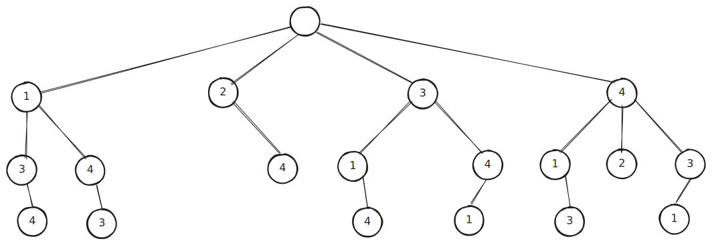
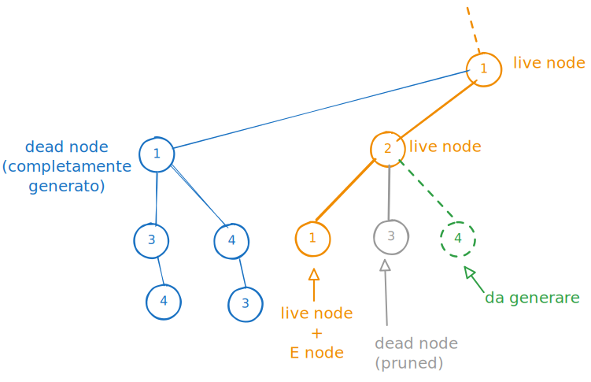
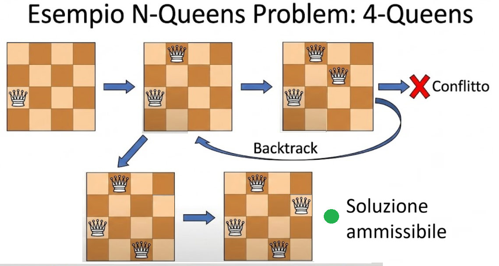

<!-- _class: titlepage -->

 Backtrack Programming 

 Concetto, origine e applicazione nella ricerca di soluzioni a problemi algoritmicamente intrattabili 

 Gabriele Brizio 

 Domanda 1.3 

 Algoritmi e Complessità 

---

# Backtrack programming

Il Backtrack programming rappresenta una strategia di esplorazione **esaustiva ma controllata**, finalizzata a ridurre il numero di stati analizzati rispetto alla visita Brute-Force.

*Definizione:*
 Il Backtrack è una tecnica di generazione e visita dello spazio di ricerca che, pur mantenendo la completezza, evita di esplorare i rami che non possono condurre a soluzioni valide o ottimali.

Si tratta di una forma di **visita con potatura**.

---

# Origine e motivazione

Questo paradigma è la naturale evoluzione di Brute-Force per far fronte all’elevata complessità.

- La visita Brute-Force analizza ogni configurazione possibile.  
- Il Backtrack introduce **condizioni di ammissibilità parziale** per interrompere anticipatamente l’esplorazione di rami improduttivi.  
- Il risultato è una **riduzione significativa del numero di stati visitati**, pur garantendo l’ottimo globale.

L’idea fondamentale è generare progressivamente gli stati, arrestando la generazione non appena si verifica la violazione di un vincolo.

---

# Struttura concettuale dello spazio di ricerca

Lo spazio di ricerca può essere rappresentato come albero in cui ogni livello corrisponde a una variabile, e ogni ramo a una decisione.

Il Backtrack genera e visita i rami **basandosi su una funzione di bound**, riducendo lo spazio effettivo esplorato.

---

# Funzione di bound

La funzione bound è la **funzione criterio** (da massimizzare/minimizzare) adattata a valutare se la soluzione in via di costruzione può diventare una risposta, se opportunamente estesa.

Si applica il **pruning**, ossia la “potatura” di ogni sotto-spazio degli stati per il quale la funzione bound predice l’impossibilità di generare soluzioni con migliore qualità
rispetto alla migliore soluzione trovata sino al punto di visita raggiunto.

---

# Generazione dello spazio di stati

Si possono suddividere i nodi in categorie

- Dead node: nodo radice di sotto-alberi non più espandibili perchè completi o potati
- Live node: nodo di cui non tutti i figli sono stati generati.
- E-node: nodo dal quale si sta per generare il prossimo figlio. Ne esiste uno solo tra i live node

---

# Relazione con la Brute-Force

| Caratteristica          | Brute-Force     | Backtrack                                    |
| ----------------------- | --------------- | -------------------------------------------- |
| Spazio visitato         | Tutto lo spazio | Solo lo spazio ammissibile                   |
| Complessità             | Esponenziale    | Esponenziale (ridotta)                       |
| Completezza             | Garantita       | Garantita                                    |
| Criterio di generazione | Sistematico     | Condizionato da vincoli                      |
| Efficienza              | Bassa           | Migliore, dipendente dalla forza dei vincoli |

Il Backtrack non modifica la struttura combinatoria, ma ne **ottimizza la visita**.

---

# Esempio N-Queens Problem

Obiettivo: posizionare $n$ regine su una scacchiera $n \times n$ in modo che nessuna attacchi un’altra.

* Ogni livello dell’albero rappresenta una riga.
* Ogni scelta corrisponde alla colonna di posizionamento.
* La generazione prosegue solo se la configurazione parziale è ammissibile (nessuna regina in conflitto).

Questo schema riduce drasticamente lo spazio esplorato rispetto alle $n^n$ combinazioni teoriche.

---

# Vincoli e condizioni di ammissibilità

La potatura si basa sulla verifica di vincoli parziali:

* **Vincoli di compatibilità** (non violare condizioni logiche o geometriche).
* **Vincoli di capacità** (non superare limiti di risorse).
* **Vincoli di coerenza** (evitare duplicazioni o configurazioni simmetriche).

La verifica anticipata di tali vincoli determina l’efficacia del Backtrack: più forti i vincoli, minore lo spazio esplorato.

---

# Complessità e riduzione dello spazio

Sia $T(n)$ il numero di stati visitati.

* Per la Brute-Force: $T(n) = O(2^n)$ o $O(n!)$.
* Per il Backtrack: $T(n) = O(b^d)$ con $b < n$, dove $d$ è la profondità e $b$ il branching effettivo ridotto.

La riduzione deriva dalla **potatura dei rami non ammissibili**:
$$
T_{backtrack} \ll T_{bruteforce}
$$

---

# Invariante di generazione e correttezza

L’algoritmo mantiene un invariante di costruzione:
ogni configurazione generata è **parzialmente valida** e può essere estesa solo se ammissibile.

L’invariante garantisce che tutte le configurazioni parziali rispettino i vincoli fino al livello corrente.

Questo consente:

* l’eliminazione sistematica di stati non validi,
* la **correttezza della generazione**,
* la **completezza della visita** entro lo spazio ammissibile.

---

# Conclusione

Il **Backtrack programming** è una tecnica che coniuga esaustività e controllo, offrendo un modello generale per l’esplorazione vincolata degli spazi di ricerca combinatori.

 È la transizione naturale dal paradigma Brute-Force alla progettazione algoritmica informata.