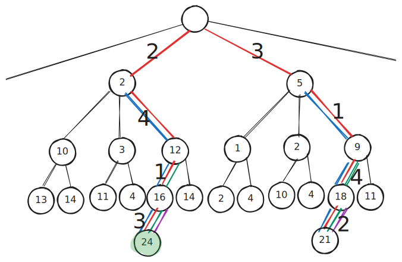

<style>   

   .cite-author {     
      text-align        : right; 
   }
   .cite-author:after {
      color             : orangered;
      font-size         : 125%;
      /* font-style        : italic; */
      font-weight       : bold;
      font-family       : Cambria, Cochin, Georgia, Times, 'Times New Roman', serif; 
      padding-right     : 130px;
   }
   .cite-author[data-text]:after {
      content           : " - "attr(data-text) " - ";      
   }

   .cite-author p {
      padding-bottom : 40px
   }

</style>


<!-- _class: titlepage -->



<div class="title"         > Least-Cost Search </div>
<div class="subtitle"      > Criteri di generazione e visita dello spazio degli stati per superare le limitazioni del Backtrack Programming </div>
<div class="author"        > Gabriele Brizio </div>
<div class="date"          > Domanda 1.4 </div>
<div class="organization"  > Algoritmi e Complessità </div>

---


# Least-Cost Search

Il paradigma Least-Cost Search nasce per superare i limiti del Backtrack Programming, introducendo un criterio di **priorità nella generazione e visita degli stati**.

*Definizione:*
La ricerca Least-Cost consiste nella generazione progressiva dello spazio degli stati, ordinando la visita in base al costo (o valore) stimato della soluzione parziale, così da esplorare prima le configurazioni più promettenti.

Questa strategia mantiene la completezza del Backtrack, ma introduce una forma di **direzionalità euristica** nella ricerca.

---

# Motivazione e contesto

Il Backtrack riduce lo spazio di ricerca eliminando configurazioni non ammissibili, ma non tiene in considerazione il valore atteso delle soluzioni parziali.

Il Least-Cost Search supera questa limitazione introducendo:
- una **funzione di costo cumulativo** per ogni stato parziale;  
- una **priorità di esplorazione** basata su tale costo;  
- un ranking di stati ordinati per valore.

L’esplorazione non procede più in profondità o ampiezza, ma secondo un ordine crescente di costo.

---

# Struttura concettuale dello spazio di ricerca

<div class="columns">

<div>

Lo spazio degli stati è rappresentato come un albero in cui:
- ogni nodo rappresenta una configurazione parziale;  
- ogni arco rappresenta una transizione valida;  
- a ciascun arco è associato un **costo incrementale**.


</div>


---

L’obiettivo è minimizzare la funzione:
$$ f(s) = g(s) + h(s)$$

### Costo cumulativo $g(s)$

Misura il costo accumulato nel percorso generato fino allo stato corrente.

### Costo stimato $h(s)$

Approssima il costo necessario per completare la soluzione.

### Costo totale $f(s) = g(s) + h(s)$

Determina la priorità di visita dello stato.

L’uso di una funzione di costo consente di integrare conoscenza e struttura, orientando la generazione verso regioni promettenti dello spazio.

---

# Principio di generazione ordinata

A differenza del Backtrack, che visita stati secondo una logica strutturale (livello, vincolo), il Least-Cost Search adotta un criterio di visita informata:

1. Generare solo stati ammissibili.  
2. Calcolare per ciascuno un **valore di costo parziale**.  
3. Inserire lo stato nella **frontiera** (struttura dati di priorità).  
4. Estrarre e visitare per primo lo stato con costo minimo.  

Questa strategia consente di concentrare la visita sugli stati più promettenti.

---

# Algoritmo generale

##

```python
def least_cost_search(start_state):
    frontier = PriorityQueue()
    frontier.push(start_state, cost=0)
    best = None
    while not frontier.empty():
        state = frontier.pop_min()  # stato a costo minimo
        if is_goal(state):
            best = state
            break
        for child in expand(state):
            if admissible(child):
                frontier.push(child, cost=eval(child))
    return best
```

Il comportamento dell’algoritmo dipende dalla **funzione di valutazione `eval()`**, che sintetizza le informazioni di costo e ammissibilità.

---

# Criteri di sintesi e correttezza

Il paradigma si fonda su due principi di sintesi:

1. **Ammissibilità**: ogni stato parziale rispetta i vincoli del problema.
2. **Ottimalità**: la funzione di costo è monotona e coerente (non decresce lungo un percorso valido).

Quando tali condizioni sono rispettate, il Least-Cost garantisce:

* la **completezza** della ricerca;
* la **correttezza** della soluzione ottimale trovata;
* la **non ridondanza** nella generazione degli stati.

---

# Strutture di supporto

* **Priority Queue (heap)** per la gestione dinamica della frontiera.
* **Tabella dei costi parziali** per evitare riesplorazioni di stati peggiori.
* **Criteri di dominanza** per eliminare soluzioni non competitive.

Tali strutture consentono di implementare versioni efficienti del paradigma, simili agli algoritmi **Dijkstra** o **A*** a seconda della funzione di costo utilizzata.

---

# Complessità computazionale

Il paradigma rimane, nel caso peggiore, **esponenziale**, ma il comportamento medio è significativamente migliorato.

La qualità dell’approssimazione $h(s)$ determina l’efficacia della riduzione dello spazio.

| Aspetto             | Backtrack           | Least-Cost                        |
| ------------------- | ------------------- | --------------------------------- |
| Criterio di pruning | Funzione di bound      | Costo parziale                    |
| Complessità media   | Ridotta (dipende dalla forza dei vincoli)                | Ridotta (dipende da qualità di h) |
| Completezza         | Garantita           | Garantita se h ammissibile        |

---

# Criteri di efficienza e potenzialità

Il paradigma **Least-Cost** apre alla possibilità di strategie **euristiche informate**, dove:

* la generazione è orientata da stime di costo (non più casuale o vincolata);
* la visita adatta dinamicamente l’ordine di esplorazione;
* il calcolo di $h(s)$ può incorporare conoscenza specifica del dominio.

Ciò lo rende adatto a problemi:

* combinatori di grandi dimensioni,
* con struttura metrica o valutativa,
* dove è nota una stima parziale della qualità della soluzione.

---

# Conclusione

Il **Least-Cost Search** rappresenta una sintesi fra esaustività e selettività.

È in grado di integrare la **struttura combinatoria** del problema con la **conoscenza del dominio**, orientando la generazione e la visita dello spazio in base a criteri di costo.

Il criterio di costo introduce una misura di intelligenza nell’esplorazione esaustiva dello spazio degli stati.
