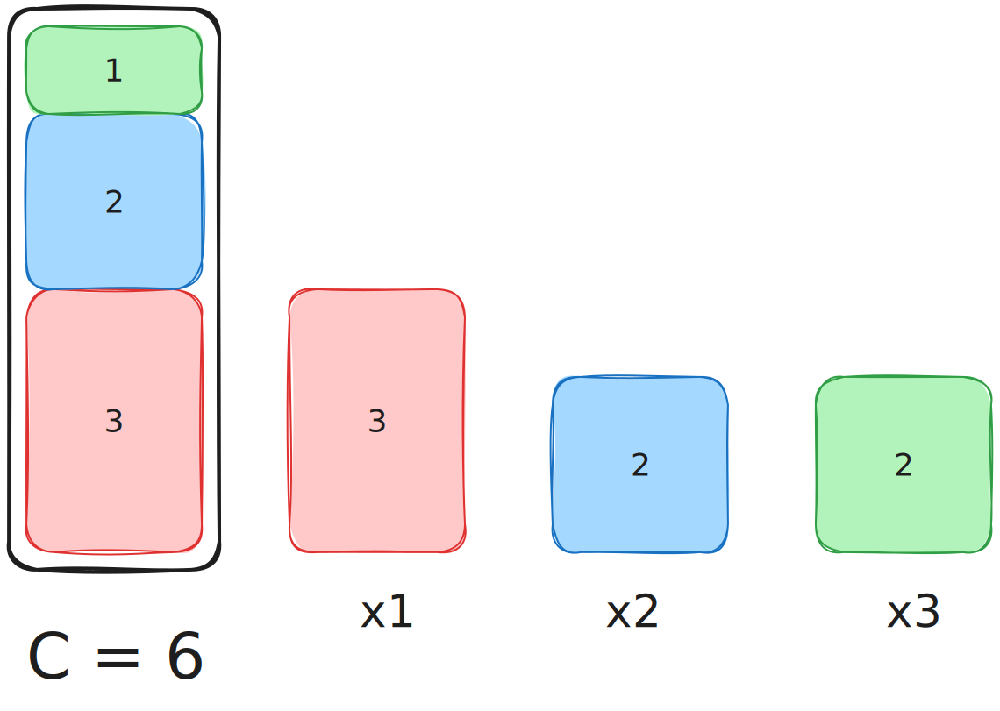
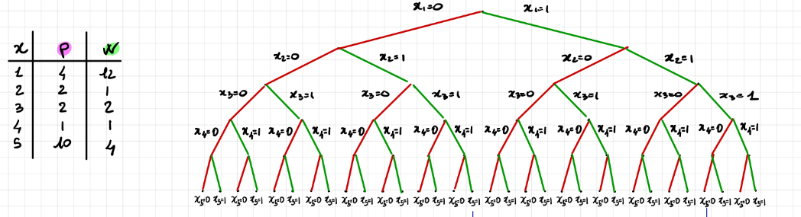

<!-- _class: titlepage -->

 Problema dello zaino 

 Panoramica sul Problema dello Zaino: rilevanza, varianti, esempi di problemi reali riconducibili a KP, ed equivalenze tra varianti. 

 Gabriele Brizio 

 Domanda 1.5 

 Algoritmi e Complessità 

---

# Il problema dello zaino

Il problema dello zaino (KP) è uno dei problemi più studiati nella teoria della complessità e dell’ottimizzazione combinatoria.

**Definizione generale:**  
Dato un insieme di oggetti ciascuno con un valore $v_i$ e un peso $w_i$, e una capacità massima $W$, si richiede di selezionare un sottoinsieme di oggetti che massimizzi il valore totale senza superare la capacità dello zaino.

$$\max \sum_{i=1}^{n} v_i x_i $$
$$ \text{soggetto a} \quad \sum_{i=1}^{n} w_i x_i \le W, \quad x_i \in \{0,1\}$$

---

# Origine e rilevanza

Il KP rappresenta un modello astratto per numerose decisioni di tipo allocativo o selettivo.  
È **NP-hard** nella sua formulazione discreta, ed è fondamentale per diversi motivi:

- È un **problema canonico di ottimizzazione combinatoria**.  
- È **modello di riferimento** per molte classi di problemi NP-completi.  
- Offre un contesto ideale per sviluppare e confrontare tecniche esatte, approssimate ed euristiche.  

Lo zaino è una metafora di ogni processo decisionale vincolato da risorse limitate.

---

# Struttura combinatoria

Lo spazio delle soluzioni del KP è costituito da tutti i **sottoinsiemi** di $n$ oggetti.

Ogni configurazione è rappresentata da un vettore binario:

$$x = (x_1, x_2, \dots, x_n) \quad \text{con} \quad x_i \in \{0,1\}$$

e quindi lo spazio ha cardinalità $2^n$.

Ogni nodo dell’albero decisionale corrisponde a una scelta “incluso / escluso”.  
La visita di questo spazio è tipicamente effettuata tramite **Brute-Force**, **Backtrack** o **Branch & Bound**.

---

# Struttura dello spazio di ricerca

Lo spazio di ricerca del KP può essere rappresentato come un **albero binario** di profondità $n$:

Ogni livello rappresenta una decisione relativa a un oggetto.  
Ogni foglia rappresenta una configurazione completa.  
L’insieme di tutte le foglie costituisce lo **spazio combinatorio** delle possibili soluzioni.

---

# Varianti principali del Problema dello Zaino

| Variante | Descrizione | Applicazioni tipiche |
|-----------|-------------|----------------------|
| **0–1 KP** | Ogni oggetto può essere incluso o escluso una sola volta | Pianificazione, selezione investimenti |
| **Fractional KP** | Oggetti frazionabili, $0 \le x_i \le 1$ | Analisi continua, rilassamento LP |
| **Unbounded KP** | Ogni oggetto può essere incluso un numero arbitrario di volte | Pseudopolinomiale | Combinazione di risorse ripetibili |
| **Multidimensional KP (MKP)** | Più vincoli di capacità | Assegnamento multiplo di risorse |
| **Multiple KP (m-KP)** | Più zaini indipendenti | Allocazione multi-progetto |
| **Quadratic KP (QKP)** | Valore dipendente da coppie di oggetti | Selezione interdipendente |

---

# Relazioni di equivalenza tra varianti

Molte varianti del KP possono essere trasformate le une nelle altre mediante:
- **Riformulazioni combinatorie** (es. duplicazione di oggetti nel bounded KP).  
- **Rilassamenti lineari** (fractional come limite del 0–1 KP).  
- **Espansioni multidimensionali** (MKP come generalizzazione).  

Esempio:

Unbounded KP $\Rightarrow$ 0–1 KP equivalente con oggetti duplicati
Fractional KP $\Rightarrow$ rilassamento continuo del 0–1 KP

Queste equivalenze consentono di trasferire tecniche e risultati tra versioni differenti.

---

# Fractional KP

Come accennato in precedenza possiamo effettuare un rilassamento continuo del 0–1 KP per ottenere il fractional KP.

A differenza del problema classico, qui è possibile spezzare gli oggetti.

Possiamo prendere una frazione $x_i$ di un oggetto, dove:
$$

0
≤
x_i
≤
1$$
> Esempio: Polvere d'oro (divisibile) vs. Lingotti (indivisibili).

---

# Strategia risolutiva del fractional KP

La soluzione ottima si può ottenere esattamente tramite un approccio **greedy**, che si basa sul rapporto profitto-peso:

- Per ogni oggetto, calcola il rapporto profitto/peso: $r=\frac{p}{w}$
- Dispone gli oggetti in ordine decrescente in base al rapporto $r$.
- Inserisce gli oggetti interi finché possibile. Quando lo zaino è quasi pieno, inserisce la frazione dell'oggetto successivo necessaria a colmare lo spazio residuo.

---

# Proprietà e struttura del problema

Il KP è caratterizzato da:

- **Linearità** della funzione obiettivo e dei vincoli.  
- **Dominanza parziale**: alcune soluzioni possono essere scartate se non migliorano simultaneamente valore e peso.  
- **Monotonicità**: l’aggiunta di oggetti non riduce il valore ma può violare la capacità.  
- **Possibilità di rilassamento continuo**, utile per bounding e euristiche.

Queste proprietà sono alla base di numerose strategie di ottimizzazione.

---

# Conclusione

Il **problema dello zaino** rappresenta uno dei modelli più generali e significativi dell’ottimizzazione discreta.  

La sua struttura combinatoria, le numerose varianti e la rilevanza applicativa ne fanno un punto di riferimento per comprendere la natura dell’intrattabilità algoritmica.

Ogni problema in cui si devono selezionare risorse limitate per massimizzare un valore può essere ricondotto, in forma o principio, al KP.  