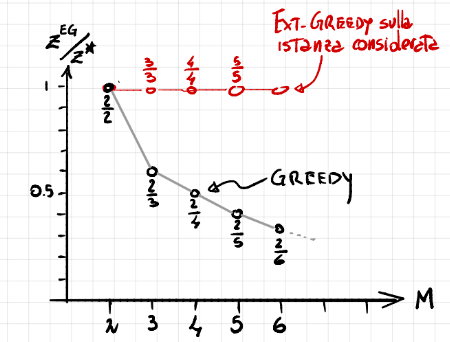

<!-- _class: titlepage -->

 Algoritmi greedy relativi al Problema dello zaino 

 Panoramica di algoritmi greedy relativi al Problema dello Zaino, Relative Performance Guarantee e Tightness 

 Gabriele Brizio 

 Domanda 1.6 

 Algoritmi e Complessità 

---

# Introduzione e contesto

Il Problema dello Zaino (KP) è centrale per diverse istanze "concrete" come Valutazioni, Bando e Rischio. La risoluzione ottimale richiede spesso strategie complesse come il **Branch & Bound**.

Per implementare un "buon" algoritmo Branch & Bound è fondamentale:
1.  Definire una funzione costo/bound efficace per potare l'albero di ricerca.
2.  Studiare gli **algoritmi Greedy** e le loro proprietà.
3.  Costruire una gerarchia di approssimazioni per stimare il profitto ottimo non noto.

L'obiettivo di questa presentazione è analizzare come algoritmi a basso costo computazionale (ordine $n \log n$) possano fornire bound e soluzioni approssimate certificate.

---

# Algoritmi Greedy

Per semplificare l'analisi, assumiamo di ordinare gli elementi in base alla loro efficienza (miglior rapporto $\frac{\text{profitto}}{\text{peso}}$).

Distinguiamo due approcci base a basso costo computazionale:

*   **Greedy (Standard):**
    Inserisce un elemento $i$ se $w + w_i \le c$. Se non entra, *continua* a scorrere gli elementi successivi ($j > i$) cercando quelli che possono essere aggiunti senza violare il vincolo di capacità.

*   **Greedy-split:**
    Inserisce elementi finché $w + w_i \le c$. Se incontra un elemento che non entra, si ferma immediatamente.
    L'indice del primo elemento che eccede la capacità è detto **split** ($s$).

---

# Analisi della aualità e il caso pessimo

La qualità della risposta di *Greedy* può degradare significativamente.
* Consideriamo la classe di istanze $(p = (2, M), w = (1, M), c = M)$ con $M \ge 2$:
*   Il rapporto $\frac{2}{M}$ decresce al crescere di $M$.
*   L'elemento ottimo di profitto $M$ non viene inserito perché il suo peso eccede di poco lo spazio residuo lasciato dal primo elemento.

### Soluzione: Ext-Greedy
Per ovviare a questo difetto, si introduce la variante **Ext-Greedy**:
Se il profitto $z_G$ fornito da Greedy è inferiore al profitto massimo di un singolo elemento, la soluzione diventa il massimo singolo profitto disponibile:
$$z_{EG} = \max \{ z_G, \max \{p_1 \dots p_n\} \}$$
Questo elimina il difetto evidenziato nel caso pessimo.

---

# Rilassamento lineare (LKP)

Il **Rilassamento Lineare (LKP)** rimuove il vincolo di interezza delle variabili $x_k$, permettendo $x_k \in [0,1]$.

L'**algoritmo Greedy-LKP** produce la risposta ottimale per il problema rilassato ($z_{LP}$):

1.  Riempie lo zaino con elementi interi fino all'indice $split-1$.
2.  Colma la capacità residua con una frazione dell'elemento *split*:
    $$ \text{Frazione} = \frac{C - \hat{w}}{w_{split}} < 1 $$
    Dove $\hat{w}$ è il peso accumulato fino a $split-1$,.

Il profitto risultante è:
$$z_{LP} = \hat{p} + (C - \hat{w}) \frac{p_{split}}{w_{split}}$$
Dove $\hat{p}$ è il profitto degli elementi interi prima dello split.

---

# Greedy Choice Property e ottimalità

L'algoritmo Greedy-LKP gode della **Greedy Choice Property**.

Questa proprietà assicura che la scelta migliore locale (basata sull'efficienza $\frac{p}{w}$) conduca alla soluzione ottimale globale del problema rilassato.
Il vettore soluzione $x_{LP}$ sarà composto da una sequenza di 1, seguiti dalla frazione dell'elemento split, e poi tutti 0:
$$x_{LP} = (1, \dots, 1, \frac{C-\hat{w}}{w_{split}}, 0, \dots, 0)$$
Il valore $z_{LP}$ ottenuto è tecnicamente ottimale per il rilassamento lineare.

---

# Gerarchia delle approssimazioni

È possibile stabilire una gerarchia rigorosa tra i valori di profitto forniti dai vari algoritmi e l'ottimo intero $z^*$.

$$ \hat{p} \le z_G \le z^* \le \lfloor z_{LP} \rfloor \le z_{LP} \le \hat{p} + p_{split} \le z_G + p_{split} $$

Dove:
*   $\hat{p}$: Profitto Greedy-split.
*   $z_G$: Profitto Greedy standard.
*   $z^*$: Ottimo intero (sconosciuto).
*   $z_{LP}$: Ottimo rilassato.

**Significato:** Con un costo computazionale basso ($n \log n$), stabiliamo un intervallo (estremo inferiore e superiore) in cui cade sicuramente l'ottimo $z^*$, evitando il costo esponenziale ($2^n$) nel caso peggiore,.

---

# Approssimazioni certificate (Performance Guarantee)

La qualità di un algoritmo greedy può essere certificata tramite la **Relative Performance Guarantee** (Garanzia Relativa di Prestazione).

### Definizione ($k$-approximation):
Un algoritmo $G$ fornisce una $k$-approximation ($0 \le k \le 1$) se per ogni istanza $I$:
$$ \frac{z_G(I)}{z^*_P(I)} \ge k $$
L'approssimazione è **tight** se esiste un'istanza $T$ per cui il rapporto coincide esattamente con $k$,.

---

# Ext-Greedy: $\frac{1}{2}$-Approximation

L'algoritmo Ext-Greedy fornisce una **$\frac{1}{2}$-approximation** per KP.

Significato: Nel caso peggiore, Ext-Greedy riempie lo zaino garantendo un profitto pari almeno alla metà di quello ottimale.

**Tightness:** Questa approssimazione è tight. Esistono istanze che spingono asintoticamente il valore di $z_{Ext-Greedy}$ verso $\frac{1}{2} z^*$. Non è possibile classificare Ext-Greedy in una classe migliore (es. $\frac{3}{4}$),.

---

# Migliorare l'approssimazione: algoritmo $G^{3/4}$

Per ottenere garanzie migliori, si introduce l'algoritmo $G^{3/4}$.
Intuitivamente, questo approccio abbozza la generazione di permutazioni essenziali (insiemi di coppie) degli elementi per poi sfruttare Ext-Greedy.

### Proprietà fondamentali:
1.  Fornisce una **$\frac{3}{4}$-approximation** per KP senza ipotesi sull'ordinamento.
2.  L'approssimazione è **tight**: esiste un'istanza che spinge il profitto verso $\frac{3}{4} z^*$.

---

# "Reverse engineering" di $G^{3/4}$

Possiamo interpretare la logica di $G^{3/4}$ attraverso una scomposizione del problema (Reverse Engineering).

L'algoritmo può essere visto come due iterazioni annidate di Ext-Greedy:
1.  Fissato un elemento $i$-esimo, usiamo Ext-Greedy sulla capacità residua $c - w_i$.
2.  Ext-Greedy garantisce $\frac{1}{2}$ del profitto residuo.
3.  Combinando la prima scelta e la seconda chiamata, l'approssimazione peggiore diventa:
    $$ \frac{1}{2} + \left( \frac{1}{2} \cdot \frac{1}{2} \right) = \frac{2}{4} + \frac{1}{4} = \frac{3}{4} $$
Questa è una lettura intuitiva della composizione delle garanzie.

---

# Interpretazione backtracking di $G^{3/4}$

$G^{3/4}$ può anche essere immaginato come un algoritmo di **Backtrack programming** limitato:
*   Spazio visitato: Insieme di disposizioni $D_{n,3}$ (elementi di classe 3).
*   Funzione Bound: Impedisce l'espansione se $j \le i$ o $w_j > w_i$ (ottimizzando la ricerca).
*   Accettazione: Aggiorna il profitto corrente $z_A$ se inferiore alla somma tra:
    *   Il profitto di Ext-Greedy (chiamato al terzo livello).
    *   La somma $p_i + p_j$ delle permutazioni nel ramo visitato.

Questo dimostra come algoritmi greedy avanzati possano essere visti come esplorazioni parziali e guidate dello spazio delle soluzioni.

---

# Conclusioni

In sintesi, per il Problema dello Zaino:
1.  Gli algoritmi Greedy e LKP forniscono risposte rapide ($n \log n$).
2.  Il Rilassamento Lineare offre un **Upper Bound** ($z_{LP}$) fondamentale per strategie Branch & Bound.
3.  Esiste una gerarchia dimostrabile: $z_G \le z^* \le z_{LP}$.
4.  Possiamo certificare la qualità delle risposte:
    *   Ext-Greedy garantisce $\frac{1}{2}$ dell'ottimo.
    *   $G^{3/4}$ garantisce $\frac{3}{4}$ dell'ottimo.

Questi strumenti costituiscono la base teorica necessaria per costruire solutori esatti efficienti.
