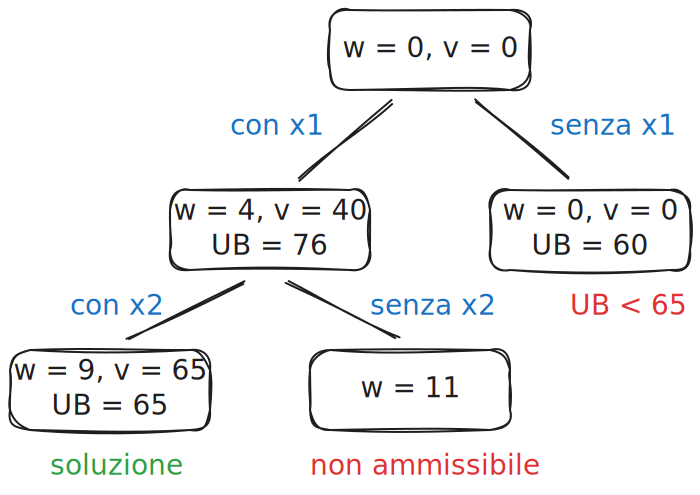

<!-- _class: titlepage -->

 Branch & Bound 

 Origine e funzionamento della tecnica algoritmica Branch & Bound relativa al Problema dello Zaino 

 Gabriele Brizio 

 Domanda 1.7 

 Algoritmi e Complessità 

---

# Introduzione: Il contesto del problema

Fissata un’istanza $\langle (p_1, \dots, p_n), (w_1, \dots, w_n), C \rangle$ del problema dello zaino (KP), con profitti $p_i$, pesi $w_i$ e capacità $C$.

*   Complessità: Il problema è intrattabile ($NP$-hard).
*   Algoritmi Greedy: Forniscono risposte a basso costo computazionale, ma non garantiscono l'ottimo globale.
*   **Branch & Bound (BB):** È la soluzione completa. Sebbene KP sia intrattabile, BB è considerato "ottimale" dagli esperti perché "raramente" impiega tempi inaccettabili per trovare una risposta certificata.

### Obiettivo
 Esplorare lo spazio degli stati in modo intelligente, utilizzando stime per potare i rami improduttivi.

---

# Branch & Bound 

Il Branch & Bound (B&B) è una tecnica generale per la risoluzione esatta di problemi di ottimizzazione combinatoria intrattabili, come il **0–1 Knapsack Problem**.

*Definizione:*
Il Branch & Bound combina generazione sistematica (branching) e limitazione analitica (bounding) per ridurre lo spazio di ricerca mantenendo la garanzia di ottimalità.

Il principio fondamentale è quello di **esplorare selettivamente** lo spazio degli stati, evitando le regioni che non possono contenere la soluzione ottima.

---

# Struttura concettuale

L’algoritmo esplora un **albero di ricerca** in cui ogni nodo rappresenta una configurazione parziale.

A ciascun nodo sono associati:
- un **valore parziale** $v(s)$;  
- un **peso cumulativo** $w(s)$;  
- un **bound superiore** $UB(s)$: stima del miglior valore ottenibile da quella configurazione.

Se $UB(s) \le \text{best\_solution}$, il ramo viene potato.

---

# 3.1 La funzione costo $\hat{c}(\cdot)$

Per guidare l'esplorazione, si definisce una funzione costo per ogni nodo dell'albero di ricerca (E-node).

$$ \hat{c}(x[0..j)) = f(h(x[0..j))) + \hat{g}(x[0..j)) $$

Dove $x[0..j)$ rappresenta l'E-node corrente (assegnamento parziale ai primi $j$ elementi).

### Le due componenti:
1.  *$f(h(x[0..j)))$:* Il valore di profitto già accumulato. È la somma dei profitti degli elementi effettivamente inseriti nello zaino fino a quel punto.

2.  *$\hat{g}(x[0..j))$:* La stima ottimistica (Upper Bound) del profitto che il sotto-albero $T[0..j)$ può ancora offrire.

---

# Stima del profitto futuro: Greedy-LKP

Il termine $\hat{g}(x[0..j))$ fornisce il profitto assicurato dall'algoritmo **Greedy-LKP** (Linear Knapsack Problem) applicato al sotto-albero rimanente.

Il calcolo si compone di due parti:
1.  La somma dei profitti degli elementi interi inseribili nell'intervallo $[j \dots \text{split})$.
2.  La porzione frazionaria dell'elemento in posizione `split` ($x[\text{split}]$). Questa porzione è calcolata come:
    *   Rapporto tra lo spazio residuo ($C$ meno spazio occupato) e il volume $w_{\text{split}}$ dell'elemento di split.

Questa stima è un **Upper Bound** (limite superiore) al profitto reale ottenibile dal nodo corrente.

---

# L'Invariante del Branch & Bound

L'invariante garantisce la correttezza e la completezza dell'algoritmo.
Esso mantiene la migliore soluzione corrente $z^*(x[0..r))$ e decide il destino del nodo corrente $x[0..j)$.

L'algoritmo opera in tre modalità rispetto all'E-node corrente:

### 1. Rifiutare (Pruning)
Il sotto-albero $T[0..j)$ viene potato (dichiarato "completo") se:
*   **Violazione Capacità:** $f(h(x[0..j))) > C$.
*   **Bound Inutile:** Pur rispettando la capacità ($f \le C$), la stima massima ottenibile non supera la soluzione migliore già nota:
    $$ f(h(x[0..j))) + zLP(x[0..j)) \le z^*(x[0..r)) $$
    In questo caso, il ramo non può contenere una soluzione migliore di quella che già possediamo.

---

### 2. Aggiornare
Se il nodo corrente è valido ($f \le C$) e il suo profitto attuale supera il migliore noto:
$$ f(h(x[0..j))) > z^*(x[0..r)) $$
Allora aggiorniamo la migliore soluzione globale ($z^*$) con il valore del nodo corrente.

### 3. Espandere
Se il nodo è valido ($f \le C$) e la promessa del sotto-albero (profitto attuale + stima futura) è superiore alla migliore soluzione nota:
$$ f(h(x[0..j))) + zLP(x[0..j)) > z^*(x[0..r)) $$
Allora è necessario **continuare l'esplorazione** generando i figli dell'E-node.

Questo meccanismo assicura che nessuna potenziale soluzione ottima venga esclusa.

---

# Esempio strutturale dello spazio

- Ogni nodo ha un **valore parziale** e un **bound superiore**.  
- Il bound è ottenuto considerando la **versione frazionaria** del KP come stima massima possibile.

---

# Esempio di funzionamento

### Passaggi principali:
1. Ordinamento degli oggetti per valore/peso decrescente.  
2. Generazione iniziale: nodo radice con bound calcolato.  
3. Espansione del nodo con bound più promettente.  
4. Aggiornamento della migliore soluzione trovata.  
5. Potatura dei nodi con $UB \le \text{best\_value}$.

### Risultato:
- Esplorazione parziale dello spazio.  
- Ottimo garantito al termine dell’esecuzione.

---

# Strategie di ordinamento della frontiera

* **Best-First Search (BFS):** esplora il nodo con bound massimo.
* **Depth-First Search (DFS):** esplora in profondità mantenendo il miglior valore globale.
* **Hybrid:** combinazione dei due criteri per bilanciare memoria e rapidità.

L’adozione della strategia influenza la complessità pratica, non la correttezza.

---

# Complessità computazionale

* **Caso peggiore:** esplorazione completa $O(2^n)$.
* **Caso medio:** fortemente ridotta grazie alla potatura.
* **Costo del bounding:** $O(n)$ per calcolare il bound tramite KP frazionario.

L’efficienza dipende dalla forza del bound: quanto strettamente approssima l’ottimo reale.

---

# Conclusione

Il Branch & Bound è:

1.  **Efficace:** Su istanze complesse l'algoritmo è molto efficace, potando quasi l'intero spazio degli stati se la visita greedy iniziale fornisce già una buona stima.
2.  **Valido:** L'unico modo per validare la correttezza dell'implementazione è confrontare la forma dell'albero di visita. Tuttavia, dettagli implementativi (come l'accodamento FIFO/LIFO a parità di stima) possono generare alberi leggermente diversi ma corretti.