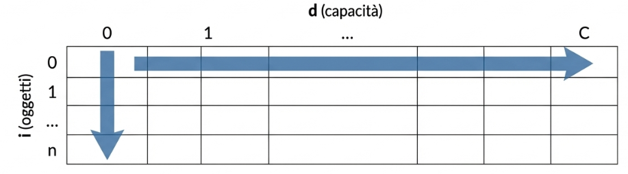
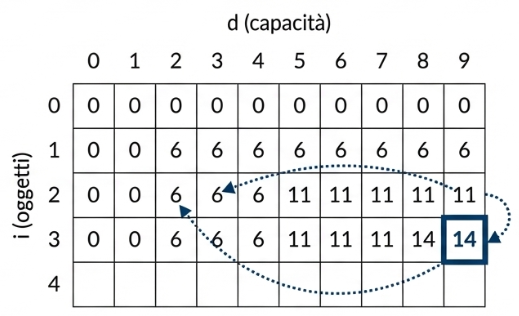

<!-- _class: titlepage -->

 Programmazione Dinamica 

 Origine, principi, intuizioni, funzionamento della “Programmazione Dinamica” 

 Gabriele Brizio 

 Domanda 1.8 

 Algoritmi e Complessità 

---

# Programmazione Dinamica

La Programmazione Dinamica è una tecnica generale introdotta da Richard Bellman negli anni ’50 per risolvere problemi di ottimizzazione caratterizzati da struttura ricorsiva e sottoproblemi sovrapposti.

*La difficoltà dei problemi complessi può essere ridotta dividendoli in sottoproblemi più piccoli, risolti una sola volta e i cui risultati vengono riutilizzati.*

---

# Principio di ottimalità

Il cuore della DP è il principio di ottimalità:

 **“Una soluzione ottima di un problema decisionale è composta da soluzioni ottime dei suoi sottoproblemi."**

Formalmente, se un problema $P$ può essere decomposto in sottoproblemi $P_1, P_2, \dots, P_k$, allora:
$$OPT(P) = f(OPT(P_1), OPT(P_2), \dots, OPT(P_k))$$
dove $f$ rappresenta la regola di composizione ottimale.

---

# Applicazione a KP

Nel Problema dello Zaino (0/1 KP), il processo decisionale per l'$i$-esimo oggetto è binario: prenderlo ($x_i=1$) o lasciarlo ($x_i=0$).

Sia $z(i, d)$ il profitto massimo considerando i primi $i$ oggetti e una capacità $d$. La formula ricorsiva diventa [7]:

$$
z(i, d) = \begin{cases} 
z(i-1, d) & \text{se } w_i > d \\
\max \{ \underbrace{z(i-1, d)}_{\text{non preso}}, \underbrace{p_i + z(i-1, d-w_i)}_{\text{preso}} \} & \text{se } w_i \le d 
\end{cases}
$$

Questo implica che per risolvere l'istanza $(n, C)$, dobbiamo aver risolto le sottostrutture ottime per $i-1$ oggetti con capacità ridotte.

---

# Da ricorsione a iterazione (Bottom-Up)

L'approccio ricorsivo diretto ricalcolerebbe gli stessi valori molte volte. La DP risolve questo problema costruendo una tabella **iterativa**.

Invece di calcolare solo $z(n, C)$, risolviamo il problema per **ogni capacità** $d$ da $0$ a $C$ e per **ogni sottoinsieme** di oggetti da $1$ a $n$.

Costruiamo una matrice $Z$ di dimensione $(n+1) \times (C+1)$.

---

# L'Algoritmo Iterativo

 

Per ogni oggetto $i$ da $1$ a $n$:
Per ogni capacità $d$ da $0$ a $C$:
1. Se l'oggetto non entra ($w_i > d$): copiamo il valore della riga precedente: $Z[i][d] = Z[i-1][d]$.
2. Se l'oggetto entra ($w_i \le d$): prendiamo il massimo tra non prenderlo ($Z[i-1][d]$) e prenderlo ($p_i + Z[i-1][d-w_i]

---

# Ricostruzione della Risposta

La tabella ci fornisce il valore del profitto massimo $z^* = Z[n][C]$. Ma quali oggetti abbiamo scelto?

Non serve memorizzare liste separate. Possiamo ricostruire la soluzione percorrendo la tabella a ritroso (**Backtracking**):

*   Partiamo da $(n, C)$.
*   Se $Z[i][d] == Z[i-1][d]$, l'oggetto $i$ non è stato preso. Ci spostiamo a $(i-1, d)$.
*   Se $Z[i][d] \neq Z[i-1][d]$, l'oggetto $i$ è stato preso. Ci spostiamo a $(i-1, d - w_i)$.

---

# Analisi della Complessità
## Perché KP rimane NP-Hard?

Il riempimento della matrice $Z$ richiede un tempo e uno spazio proporzionali alla dimensione della matrice stessa.

$$ S(n, C) \approx O(n \cdot C) $$
$$ T(n, C) \approx O(n \cdot C) $$

Apparentemente, questo sembra un polinomio ($n \times C$). Tuttavia, dobbiamo considerare la dimensione dell'input in termini di bit.

---

# La Pseudo-polinomialità

La complessità $O(n \cdot C)$ è **pseudo-polinomiale**.

*   La dimensione dell'input include il numero di oggetti $n$ e il numero di bit necessari a rappresentare $C$ (cioè $\log_2 C$).
*   Il valore $C$ cresce esponenzialmente rispetto al numero di bit usati per scriverlo ($C = 2^{\log_2 C}$).
*   Quindi, rispetto alla lunghezza della codifica dell'input, la complessità è esponenziale:
    $$ O(n \cdot 2^{\text{bits di } C}) $$

Se $C$ è molto grande (es. $2^{100}$), la tabella diventa intrattabile.

---

# Conclusioni sulla DP per KP

**Garanzia di Ottimo:** A differenza delle euristiche Greedy, la DP garantisce sempre la soluzione esatta $z^*$ grazie al Principio di Ottimalità.

**Approccio All-capacities:** Risolve implicitamente il problema per tutte le capacità intermedie fino a $C$.

**Limiti:** L'efficienza dipende dal valore numerico di $C$. È ideale per istanze con capacità contenuta, ma impraticabile per valori di $C$ arbitrariamente grandi (confermando la natura NP-Hard del problema).