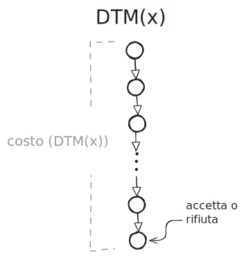

<!-- _class: titlepage -->

 Modelli computazionali e complessità computazionale 

 Strumenti formali e riflessioni che giustificano la possibilità di usare modelli computazionali arbitrari, ma ragionevoli,
per descrivere la complessità computazionale di algoritmi. 

 Gabriele Brizio 

 Domanda 2.1 

 Algoritmi e Complessità 

---

# Motivazioni

### Perché servono modelli di calcolo?

Nel progettare algoritmi ci si imbatte in problemi per i quali non è noto un algoritmo efficiente, o in istanze che richiedono tempi di esecuzione proibitivi.  

Obiettivo: **classificare i problemi per difficoltà computazionale**.

Risulta necessario un quadro teorico che permetta di:  
  - confrontare problemi diversi,  
  - identificare problemi intrattabili,  
  - mantenere robustezza rispetto alla scelta del modello.

---

# Trattabilità vs Intrattabilità

### Due macro-classi fondamentali

| PTime (P)           | NPTime (NP)                |
| ------------------------ | ------------------------ |
| Problemi risolvibili con algoritmo deterministico polinomiale. | Problemi verificabili in tempo polinomiale tramite certificato, oppure risolvibili tramite modello non deterministico polinomiale. |

Questa distinzione è basata su un criterio asintotico: non interessa la velocità assoluta, ma come il tempo cresce rispetto alla dimensione dell’input.  

Si vuole formalizzare cosa rende un problema *trattabile* o *intrattabile* e garantire che la classificazione non dipenda dal modello scelto.

---

# Ruolo della rappresentazione

### Per definire complessità servono:

- **un linguaggio domain-specific** per rappresentare le istanze;  
- **una funzione di misura** della dimensione dell’input;  
- una rappresentazione che non alteri artificialmente la complessità.

### Perché è importante?

Dato che la complessità dipende **dalla lunghezza dell’input**, l’obiettivo è evitare codifiche che gonfino artificialmente la lunghezza dell’input: una cattiva rappresentazione porterebbe a valutazioni fuorvianti dei tempi di esecuzione.

---

# Notazioni ragionevoli

## Cosa significa “rappresentazione ragionevole”?

Una notazione è ragionevole se:

- utilizza una **codifica concisa**, senza simboli superflui;
- usa notazione **posizionale** per i valori numerici (binaria, non unaria);
- qualunque altra notazione ragionevole può essere convertita con una funzione **polinomiale**.

### Conseguenza fondamentale:

Se un problema è intrattabile con una notazione ragionevole, lo è con tutte.

---

# Modelli computazionali classici

### Modello canonico: Macchina di Turing deterministica (DTM)

- Formalismo minimale e preciso.  
- Definizione di algoritmo universalmente accettata.  
- Base per le classi di complessità PTime, NPTime.

---

# Macchina di turing deterministica (DTM)

### Il fondamento formale del calcolo

La DTM è il modello astratto standard per definire il concetto di **algoritmo** e la base della teoria della complessità. È universalmente accettata (grazie alla Tesi di Church-Turing) come il modello capace di eseguire qualsiasi calcolo.

### Caratteristica chiave:

Il funzionamento della DTM è **deterministico**: in ogni istante, la configurazione corrente ammette **una sola mossa possibile** successiva. Questo la rende la base per la classe di complessità **P (PTime)**.

---

### Componenti principali:

* **Nastro (Tape):** Memoria potenzialmente **infinita** di celle, contenente input e calcoli (simboli da un alfabeto finito).
* **Testina (Head):** Legge, scrive e si sposta di una cella alla volta (Sinistra o Destra).
* **Stati e Regole:** Un **insieme finito di stati** rappresenta lo stato interno. Le **regole di transizione** specificano:

Stato attuale + Simbolo letto $\rightarrow$ Nuovo stato + Simbolo da scrivere + spostamento

### Ma…

- poco espressiva e innaturale rispetto agli algoritmi reali;  
- manipola stringhe binarie, non strutture di alto livello.

---

# Perché non solo Macchine di Turing?

### Problemi del modello:

- astrazione troppo “bassa”;  
- difficile esprimere strutture dati o algoritmi complessi;  
- non rispecchia i modelli di programmazione reali.

Di conseguenza, ci si orienta verso modelli alternativi che permettono una descrizione naturale degli algoritmi, a patto che rimangano **equivalenti** a una macchina di Turing entro fattori polinomiali.

Questa condizione evita che il modello scelto alteri la classificazione dei problemi.

---

# Linguaggi Imperativi Deterministici e Non Deterministici

I modelli **LID** (deterministico) e **LIND** (non deterministico) rappresentano linguaggi imperativi astratti con operazioni di uso comune: variabili, strutture dati, cicli e condizioni.  

Caratteristiche:

- simili al tradizionale pseudocodice;  
- esprimono strutture dati complesse;  
- supportano controlli di flusso standard;  
- LIND include meccanismi di scelta non deterministica.

LID e LIND sono molto più vicini al modo in cui si progettano algoritmi nella pratica, ma sono comunque definiti in maniera rigorosa e controllabile dal punto di vista teorico.

---

# Equivalenza tra modelli

Il risultato chiave è che LID, LIND e macchine di Turing sono **equivalenti fino a un overhead polinomiale**.  
Ogni algoritmo espresso in LID o LIND può essere tradotto in una DTM o NDTM con un aumento polinomiale del tempo.  

Questo si basa su due osservazioni:  
- qualsiasi struttura dati può essere codificata in binario con una crescita polinomiale della dimensione;  
- ogni istruzione imperativa può essere simulata da una macchina di Turing con complessità anch’essa polinomiale.

---

# Perché l’equivalenza polinomiale è sufficiente

La teoria della complessità ragiona **a meno di polinomi**:

- differenze polinomiali non cambiano l’appartenenza a P o NP;
- non alterano la trattabilità;
- non influenzano le riduzioni polinomiali.

### Quindi:

Se due modelli differiscono solo per un overhead polinomiale, le classi di complessità ottenute sono **identiche**.

---

# Robustezza delle classi di complessità

Grazie a rappresentazioni ragionevoli e modelli equivalenti, la complessità computazionale diventa una proprietà **robusta** del problema, indipendente dal linguaggio o dal modello adottato.  

Le classi P e NP rimangono invariate e il concetto di intrattabilità assume un significato univoco, non legato alle scelte implementative.  

Questo consente di analizzare la difficoltà dei problemi concentrandosi sulla loro natura, non sul formalismo utilizzato.

---

# Sintesi finale

Possiamo usare modelli computazionali arbitrari ma ragionevoli perché:

- le **notazioni ragionevoli** garantiscono codifiche concise e confrontabili;
- i **modelli imperativi** sono naturali e più espressivi delle DTM;
- l’**overhead polinomiale** assicura equivalenza delle classi P e NP;
- la **robustezza** della teoria consente di parlare di trattabilità senza dipendere dal modello.

### Conclusione:

La complessità computazionale non dipende dal linguaggio né dal modello, ma solo dalla difficoltà intrinseca del problema.
