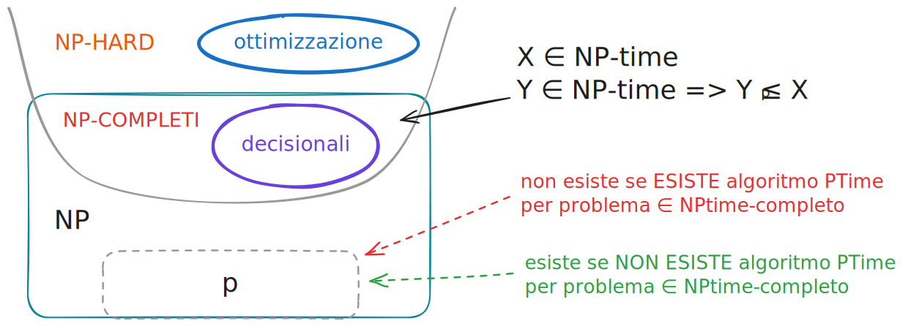

<!-- _class: titlepage -->

 Riduzioni polinomiali 

 Motivazioni, principali proprietà e implicazioni delle riduzioni tra problemi computazionali. 

 Gabriele Brizio 

 Domanda 2.2 

 Algoritmi e Complessità 

---

# Motivazioni

Per classificare la difficoltà dei problemi computazionali è necessario uno strumento che permetta di **confrontare** due problemi in modo astratto, indipendentemente:

- dalla notazione con cui rappresentiamo le istanze;
- dal modello di calcolo utilizzato;
- dall’algoritmo scelto.

Le riduzioni polinomiali nascono come risposta alla domanda fondamentale:

*“Dato un problema intrattabile, possiamo trasferire questa difficoltà a un altro problema?”*

Sono alla base dell’intera teoria della **NP-completezza**, che lavora su problemi decisionali ed è progettata per identificare famiglie di problemi “equidifficili”.

---

# Problemi decisionali e complessità

La teoria considera una versione decisionale dei problemi: un linguaggio $L$ di istanze per cui la risposta è *sì* oppure *no*.

Esempi:  
- **KP decisionale**  → “esiste una selezione con peso $≤ W$ e profitto $≥ l$ ?”  
- **TSP decisionale** → “esiste un ciclo di costo $≤ K$?”

Le versioni decisionali permettono una formulazione uniforme e consentono di applicare le riduzioni.

Molti problemi funzionali e ottimizzativi possono essere portati alla forma decisionale e viceversa attraverso trasformazioni polinomiali.

---

# Riduzione polinomiale: idea intuitiva

Dato un problema A e un problema B, diciamo che **A si riduce a B** (A ≤ₚ B) se esiste una trasformazione efficiente che riscrive ogni istanza di A in un’istanza di B, conservando la risposta *sì/no*.

L’idea centrale è:
 se **A è difficile**,  e **A si riduce a B**, allora anche **B deve essere almeno difficile quanto A**.

È una forma di “compilazione”: traduciamo istanze di un problema nel dominio dell’altro mantenendo coerenza semantica.

---

# Definizione formale di riduzione polinomiale

Siano $P_1$ e $P_2$ due problemi decisionali, con i rispettivi  linguaggi $L_{P_1}, L_{P_2}$ riconosciuti dalle macchine di turing che decidono i problemi $P_1$ e $P_2$.

Diciamo che **$P_1$ si riduce polinomialmente a $P_2$** $e scriviamo $P_1 \leq_p P_2$ se:

$$
P_1 \le_p P_2 \quad \text{sse} \quad
\exists F : \text{Dom}(P_1)\to\text{Dom}(P_2)
$$

tale che:

* $x \in L_{P_1} \Rightarrow F(x) \in L_{P_2}$
* $x \notin L_{P_1} \Rightarrow F(x) \notin L_{P_2}$
* $F$ è calcolabile in tempo $p(|x|)$ per un qualche polinomio $p$

e in tal caso:

* se $P_2 \in Ptime \Rightarrow P_1 \in Ptime$
* $P_1$ intrattabile ⇒ $P_2$ intrattabile

---

# Significato della relazione A ≤ₚ B

Questa relazione permette di confrontare la difficoltà di problemi diversi:

- se A ≤ₚ B, allora **B è almeno difficile quanto A**;
- simmetricamente, **A è difficile al più quanto B**.

La riduzione è una relazione fra **problemi decisionali**, e consente di costruire “catene” o “alberi della difficoltà”.

---

# Proprietà fondamentali della riduzione

### **Transitività**

Se $A ≤\leq_p B$ e $B \leq_p C$, allora $A \leq_p C$.  
Questa proprietà è il motore principale delle dimostrazioni di NP-completezza.

### **Preservazione della trattabilità**

Se $A \leq_p B$ e $B ∈ PTime$, allora $A ∈ PTime$.  
Una soluzione efficiente per B permette di risolvere anche A.

### **Trasferimento dell’intrattabilità**

Se A è intrattabile (cioè non noto alcun algoritmo polinomiale)  
e $A \leq_p B$,  
allora anche B deve essere intrattabile.

---

# Implicazioni concettuali

Le riduzioni polinomiali permettono di:

- strutturare la classe NP in famiglie di problemi equivalenti per difficoltà;
- identificare quali problemi sono “più difficili” di altri;
- capire in quali condizioni PTime potrebbe coincidere con NPTime;
- classificare problemi secondo il loro grado di intrattabilità.

In altre parole, forniscono una metrica di confronto tra problemi in termini di complessità.

---

# NP-completezza

Un problema C è **NP-completo** se:

1. $C \in NP$ 
2. ogni $A ∈ NP$ si riduce a $C (A \leq_p C)$.

Questo fa di C uno dei problemi “più difficili” della classe NP: se trovassimo un algoritmo polinomiale per C, lo avremmo automaticamente per **tutti** i problemi in NP.

---

# Conseguenza centrale

Se un solo problema NP-completo venisse risolto in tempo polinomiale, allora:

- tutte le riduzioni rimarrebbero valide,
- ogni problema in NP verrebbe risolto in tempo polinomiale,
- si avrebbe **PTime = NPTime**.

---

# Perché le riduzioni sono indispensabili

Le riduzioni:

- forniscono un modo oggettivo per confrontare complessità diverse;
- permettono di spostare la difficoltà da un problema noto a uno nuovo;
- rendono possibile riconoscere problemi “equidifficili”;
- sono lo strumento teorico che fonda l’intera teoria dell’intrattabilità.

Senza riduzioni, non avremmo alcun metodo per certificare la difficoltà dei problemi se non l’assenza di algoritmi noti.

---

# Sintesi finale

La riduzione polinomiale è il fondamento formale che ci permette di parlare di “difficoltà computazionale”.  

Le sue proprietà garantiscono confronti affidabili tra problemi.  

Grazie a questo concetto, la teoria della complessità definisce:

- PTime e NPTime come classi robuste;  
- la nozione di NP-completezza;  
- la struttura interna della classe NP;  
- il significato della domanda P vs NP.