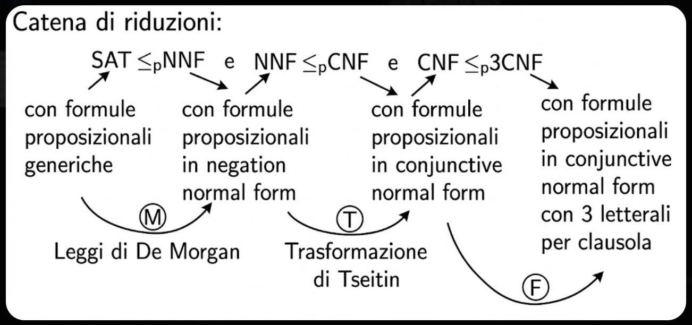

<!-- _class: titlepage -->

 

Catena di riduzioni $SAT \le_p NNF \le_p CNF \le_p 3CNF$

 Aspetti fondamentali relativi alla catena di riduzioni 

 Gabriele Brizio 

 Domanda 2.3 

 Algoritmi e Complessità 

---

# Panoramica

---

# Normalizzazioni sintattiche delle formule

## **NNF — Negation Normal Form**

Una formula è in **NNF** se:

- le negazioni compaiono solo davanti a variabili,
- non compaiono negazioni su formule composte,

**Esempio**  
Formula arbitraria:  
$F = \neg(p \land (q \lor \neg r))$

Forma NNF:  
$NNF(F) = (\neg p \lor (\neg q \land r))$

## **CNF — Conjunctive Normal Form**

Una formula è in **CNF** se è una:

- congiunzione di clausole,  
- ognuna composta da disgiunzioni di letterali.

**Struttura:**  
$$(l_{1,1} \lor l_{1,2} \lor \dots) \ \land \ (l_{2,1} \lor l_{2,2} \lor \dots) \ \land \dots$$

**Esempio**  
$(p \lor \neg q \lor r) \ \land\ (\neg p \lor s)$

---

## **3CNF — 3-Conjunctive Normal Form**

Una formula è in **3CNF** se:

- è una CNF,
- **ogni clausola contiene esattamente 3 letterali**.

**Esempio**  
$(p \lor q \lor r) \ \land\ (\neg p \lor s \lor t)$

---

# I problemi di soddisfacibilità

SAT è il seguente problema decisionale:

**Dato una formula proposizionale $F$, esiste un’assegnazione $\varphi$ che rende $F$ vera?**

Dati i rispettivi insiemi sintattici (NNF, CNF, 3CNF), si definiscono i problemi:

**Dato $F \in NNF/CNF/3CNF$, esiste un’assegnazione $\varphi$ che la soddisfa?**

Questi problemi sono equivalenti dal punto di vista della soddisfacibilità, ma diversi dal punto di vista strutturale, il che permette di costruire la catena di riduzioni:

$$SAT \le_p NNF \le_p CNF \le_p 3CNF$$

---

# Prima riduzione: $SAT \le_p NNF$

## Obiettivo
Trasformare qualsiasi formula proposizionale in **Negation Normal Form**, dove:

- le negazioni compaiono solo davanti alle variabili,
- non sono ammesse negazioni di formule composte.

## Trasformazione
Ricorsivamente si applicano:

- doppia negazione: $\neg\neg G \to G$  
- ***leggi di De Morgan***:  
  $\neg(G \land H) = (\neg G \lor \neg H)$  
  $\neg(G \lor H) = (\neg G \land \neg H)$

## Correttezza
La trasformazione è:

- polinomiale,  
- strutturale,  
- semanticamente corretta:  

$$F \in SAT \iff NNF(F) \in SAT$$

---

# Seconda riduzione: $NNF \le_p CNF$

## Obiettivo
Convertire una formula in NNF in **Conjunctive Normal Form** (CNF).

***Trasformazione di Tseitin***

- Si interpreta la formula come un circuito.  
- A ogni sottoformula si associa una nuova variabile $a_G$.  
- Per ogni operatore si aggiungono vincoli CNF che esprimono:  

$$a_G \leftrightarrow (g \ \circ \ h)$$

Il risultato è un insieme di clausole che “certifica” il comportamento dell’intera formula.

$$F \in NNF \iff T(F) \in CNF$$

---

# Dimostrazione

**Teorema**: Per ogni formula $f \in NNF$ vale:
$$
f \in SAT \iff T(f) \in CNF\text{-}SAT
$$

Per definizione della trasformazione di Tseitin: $T(f) = [a], C[a,f]$

Assumiamo $f \in NNF$ e sia $\varphi$ un’assegnazione tale che $\exists \varphi \ \upphi_\varphi(f)=\text{true}$

Osserviamo che esiste un’estensione $\varphi'$ di $\varphi$ alle variabili introdotte da $T$ tale che:
$$
\varphi'(C[a_f,f])=\text{true} \ \land\ \varphi'(a_f)=\text{true}.
$$

---

Per il **Lemma T**, vale l’equivalenza strutturale:
$$
\exists \varphi \ \upphi_\varphi(f)=\text{true}
\iff
\big(\exists \varphi' \ \upphi_{\varphi'}(C[a,f])=\text{true} \ \land\ \varphi'(a)=\text{true}\big).
$$

Dalla direzione sinistra verso destra otteniamo dunque che
$$\big(\exists \varphi' \ \upphi_{\varphi'}(C[a,f])=\text{true} \ \land\ \varphi'(a)=\text{true}\big)$$
è equivalente a
$$\big(\exists \varphi' \ \upphi_{\varphi'}(T(f))=\text{true})$$

cioè:
$$
T(f) \in CNF.
$$

---

# Lemma T: schema di dimostrazione

Partendo da una tesi in due punti:

1. $A(f) \Rightarrow B(f)$
2. $C(f) \Rightarrow D(f)$

ed una funzione $f$ composta $f=g\circ h$

Il passo induttivo dipenderà da quanto è difficile f (nel nostro caso $g \circ h$)

Conoscendo $g$ ed $h$ se si riesce a dimostrare che $A$ è vera su $g$ e $C$ è vera su $h$ allora posso usare il modus ponens

---

### **Usare la struttura di $f$ per risalire le proprietà**

Dal fatto che $A(f)$ sia vero, possiamo ricavare condizioni su $A(g)$ e $C(h)$.

Questo step dipende dal tipo di operatore ($\land$, $\lor$, $\neg$), ma lo schema è sempre:

$$A(f) \ \text{vero} \quad \Rightarrow \quad A(g)\ \text{vero} \ \text{e} \ C(h)\ \text{vero}$$

**$A(g\circ h)$ vero ⇒ $A(g)$ vero e $C(h)$ vero**

 

### **Applicazione delle ipotesi induttive**

Da qui il diagramma si biforca:

* **Da $A(g)$** la prima ipotesi induttiva dà
  
  $$A(g) \Rightarrow B(g)$$

  
  

* **Da $C(h)$** la seconda ipotesi induttiva dà
  
  $$C(h) \Rightarrow D(h)$$

---

### **Ricombinazione per concludere su $f$**

A questo punto abbiamo:

* $B(g)$ vero
* $D(h)$ vero

Ora, per la struttura dell’operatore $\circ$, questo implica:

**$B(g)$ vero e $D(h)$ vero ⇒ $B(g\circ h)$ vero**

---

## **Conclusione dello schema**

L’intero Lemma T dice, in sostanza:

Se si riesce a dimostrare la tesi per i casi base (variabili)
 e ogni passo induttivo per i costruttori (negazione e operatori binari) segue lo schema “scomponi → applica ipotesi → ricompone”,

allora le due implicazioni $A(f)⇒B(f)$ e $C(f)⇒D(f)$ valgono per tutte le formule.

---

# Terza riduzione: $CNF \le_p 3CNF$

## Obiettivo
Convertire ogni clausola in una formula in cui ogni clausola ha **esattamente 3 letterali**.

## Strategia
Una clausola lunga come:

$$(l_1 \lor l_2 \lor l_3 \lor l_4 \lor l_5)$$

viene riscritta introducendo nuove variabili ausiliarie:

$$
(l_1 \lor l_2 \lor a_1) \land
(\neg a_1 \lor l_3 \lor a_2) \land
(\neg a_2 \lor l_4 \lor l_5)
$$

Le nuove variabili mantengono la soddisfacibilità senza crescita esponenziale.

---

# Relazione fra le riduzioni

La catena:

$$SAT \le_p NNF \le_p CNF \le_p 3CNF$$

ha le seguent proprietà fondamentali:

- ogni trasformazione è polinomiale,  
- ogni trasformazione preserva la soddisfacibilità,  
- la struttura sintattica viene progressivamente normalizzata.

Risultato:  
$F$ è soddisfacibile ⇔ la sua forma $3CNF(F)$ lo è.

---

# Importanza della catena

Questa sequenza di riduzioni:

- è il cuore della dimostrazione che **3SAT è NP-completo**,  
- mostra come sia possibile raggiungere forme sintattiche altamente vincolate mantenendo la semantica,  
- introduce tecniche fondamentali usate in tutte le riduzioni NP-complete (nuove variabili, Tseitin, splitting).

Rappresenta uno degli esempi più eleganti di trasferimento controllato di complessità tramite normalizzazione sintattica.

---

# Sintesi finale

La catena $SAT \to NNF \to CNF \to 3CNF$:

- usa trasformazioni polinomiali,  
- mantiene la soddisfacibilità,  
- produce formule sempre più strutturate,  
- permette di capire perché 3SAT è un problema “universale” per NP,  
- è supportata dal Lemma T che fornisce lo schema di correttezza induttiva.
