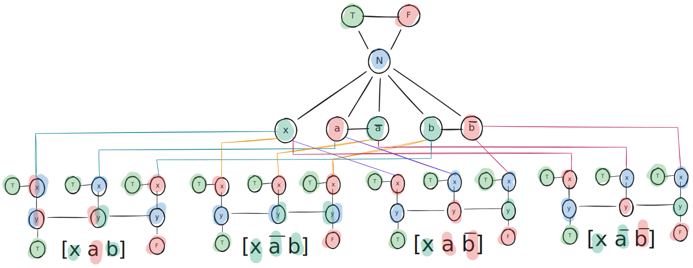
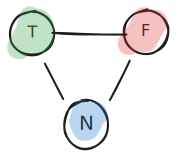
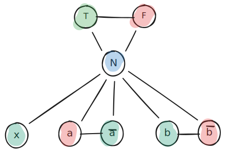
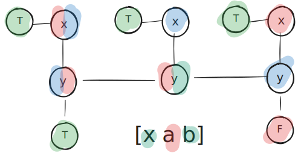
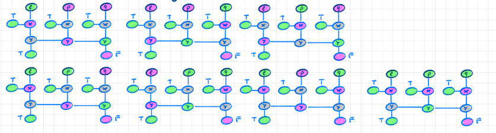
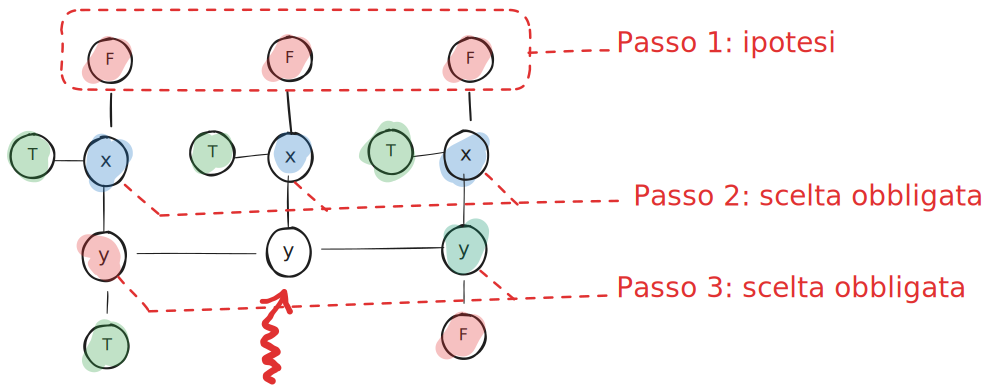

<!-- _class: titlepage -->

 

Riduzione $3CNF \le_p 3COL$

 Aspetti fondamentali relativi alla riduzione di 3CNF a 3COL
 

 Gabriele Brizio 

 Domanda 2.4 

 Algoritmi e Complessità 

---

# Riduzione $3CNF \le_p 3COL$

Obiettivo: trasformare una formula booleana in forma $3CNF$ in un grafo $G$ tale che:

**$F$ è soddisfacibile ⇔ $G$ è 3-colorabile**

---

# Il problema 3COL

### Definizione
Dato un grafo $G=(V,E)$, esiste una funzione di colorazione
$$c: V \to \{1,2,3\}$$
tale che per ogni arco $(u,v) \in E$ vale:
$$c(u) \ne c(v)$$

### Interpretazione
I 3 colori rappresentano tre stati distinti, li chiameremo:

- **T** = True  
- **F** = False  
- **N** = Neutro  

---

# L'idea generale della riduzione

Data una formula $F$ in $3CNF$:

$$
F = (l_{1,1} \lor l_{1,2} \lor l_{1,3}) 
\land (l_{2,1} \lor l_{2,2} \lor l_{2,3}) 
\land \dots
$$

Costruiamo un grafo $G$ con tre tipi di gadget:

1. **Triangolo dei colori (T–F–N)**  
2. **Gadget dei letterali**  
3. **Gadget delle clausole**

In modo che:

- la colorazione dei letterali rappresenti una possibile assegnazione booleana,  
- le clausole siano forzate ad avere almeno un letterale vero.

---

# Il triangolo dei colori (gadget di base)

È un triangolo completo con tre nodi:

- **N** (Neutro)  
- **T** (True)  
- **F** (False)

collegati tutti tra loro.

Una 3-colorazione del triangolo impone automaticamente che:

- $c(N)$, $c(T)$, $c(F)$ siano tre colori distinti.  
- Qualunque nodo collegato a $N$ deve avere colore ≠ $c(N)$.  

**Questo gadget stabilisce i tre “colori logici” globali.**

---

# Gadget dei letterali

Per ogni variabile $x$ nella formula, creiamo due nodi:

- un nodo per il letterale $x$  
- un nodo per il letterale $\neg x$  

Entrambi collegati al nodo **N** del triangolo dei colori.

*Proprietà:* Poiché sono collegati a **N**, possono usare solo colori {T,F}.

Non sufficiente -> si aggiunge un arco tra variabili complementari

Questa struttura impone **consistenza logica dei valori booleani**.

---

# Perché non basta ancora?

Finora si è modellato:

- valori di verità coerenti per i letterali,  
- assegnazione booleana globale.

Ma una formula $3CNF$ è soddisfatta solo se **ogni clausola ha almeno un letterale vero**.

Serve quindi un gadget che “controlli” ogni clausola.

---

# Gadget delle clausole

Per ogni clausola $(l_1 \lor l_2 \lor l_3)$ costruiamo un gadget che:

1. è collegato ai nodi letterali $l_1$, $l_2$, $l_3$,  
2. può essere 3-colorato **solo se almeno uno dei tre letterali usa il colore T**.

### Struttura

Il gadget è progettato per impedire che:

- **tutti e tre i letterali abbiano colore F**,  
- cioè impedire che la clausola sia falsa.

### Proprietà fondamentale
Il gadget della clausola è 3-colorabile **solo se almeno uno dei letterali è T**.

---

# Proprietà del gadget della clausola

### **(1) Il sottografo $x,y_1,y_2,y_3$ è colorabile solo se $x=y_1$ o $x=y_3$ o $y_1=y_3$**

---

### **(2) Se i letterali sono tutti falsi allora il grafo $\notin 3COL$**

---

# Esempio

---

# Dimostrazione

### **(1) Se $f \in 3CNF$ allora $L(f)\in 3COL$**

Per ciascuna possibilità la **proprietà 1** assicura la colorabilità del sottografo

### **(2) Se $f \notin 3CNF$ allora $L(f)\notin 3COL$**

Se tutti i letterali sono falsi allora dalla **proprietà 2** sappiamo che il sottografo non è colorabile, quindi l'intero grafo non lo è.

---

# Complessità e conclusione

La trasformazione:

- usa un numero di gadget lineare nel numero di variabili e clausole,  
- introduce solo un numero costante di nodi per variabile e per clausola,  
- si costruisce in tempo $O(|f|)$.
 

### Conclusione
$$f \in 3CNF\text{-SAT} \iff L(f) \in 3COL$$

La riduzione è corretta e polinomiale.