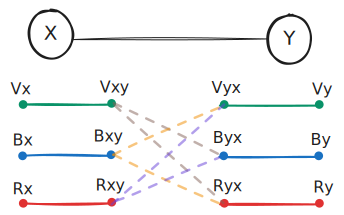
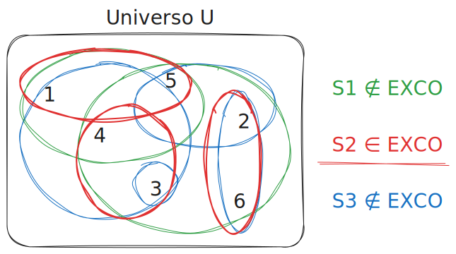
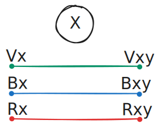
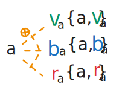

<!-- _class: titlepage -->

 

Riduzione $3COL \le_p EXCO$

 Aspetti fondamentali relativi alla riduzione di 3COL a EXCO
 

 Gabriele Brizio 

 Domanda 2.5 

 Algoritmi e Complessità 

---

# Riduzione $3COL \le_p EXCO$

Obiettivo: trasformare un grafo $G$ in un’istanza del problema **Exact Cover (EXCO)** tale che:

**$G$ è 3-colorabile ⇔$E(G)$ ha una copertura esatta**

---

# Il problema EXCO

### Universo
Un insieme finito $U$.

### Raccolta di sottoinsiemi
$\mathcal{S} \subseteq \mathcal{P}(U)$.

### Domanda
Esiste un sottoinsieme $\mathcal{S}' \subseteq \mathcal{S}$ tale che:

- gli insiemi in $\mathcal{S}'$ sono **a due a due disgiunti**,  
- la loro unione è **esattamente $U$**?

In altre parole ogni elemento di $U$ deve essere coperto **una e una sola volta**.

---

# Intuizione della riduzione 3COL → EXCO

Vogliamo codificare la 3-colorazione come una scelta di sottoinsiemi.

*Idea* 
Per ogni **possibile colorazione di un nodo**, costruiamo sottoinsiemi che:

- includono l’elemento del nodo,  
- includono elementi che rappresentano come il colore si “propaga” verso i suoi vicini,  
- sono costruiti in modo che **solo una colorazione valida** produce una copertura esatta.

Il punto cruciale: EXCO seleziona esattamente un sottoinsieme per nodo → esattamente un colore per nodo.

---

# Costruzione intuitiva dei “colori” come sottoinsiemi

Per ogni nodo $x$ e colore $c \in \{v,b,r\}$ costruiamo un sottoinsieme:

$$\{x, c_x\}$$

che rappresenta “$x$ è colorato con $c$”.

Esempio: un nodo $x$ collegato ai tre possibili insiemi $\{x,v_x\}$, $\{x,b_x\}$, $\{x,r_x\}$.

Per ottenere coperture esatte solo uno dei tre insiemi potrà venire scelto, perché ogni insieme contiene **l’elemento $x$**, che deve essere coperto **una sola volta**.

---

# Propagazione della colorazione attraverso gli archi

Se $x$ e $y$ sono adiacenti, non possono avere lo stesso colore.

Nel modello EXCO questo viene imposto creando “elementi di propagazione”, ad esempio:

 $c_{xy}$ = propagazione del colore $c$ da $x$ verso $y$

  $c_{yx}$ = propagazione del colore $c$ da $y$ verso $x$

---

Ogni scelta $\{x,c_x\}$ include anche elementi come:

- $c_{xy}$ (propagazione verso ogni vicino)

che devono essere coperti da altri insiemi coerenti con il colore scelto.

Esempio: arco $x$–$y$ con elementi etichettati $v_{xy}$, $v_{yx}$, $b_{xy}$, $b_{yx}$, $r_{xy}$, $r_{yx}$.

---

# Perché servono elementi intermedi?

Se usassimo solo gli insiemi $\{x,cx\}$, molte coperture esatte sarebbero possibili ma corrisponderebbero a colorazioni **non valide**.

Esempio problematico:
- potrei scegliere $\{x, v_x\}$ e $\{y, v_y\}$ anche se $x$ e $y$ sono adiacenti.

### La soluzione
Aggiungere **elementi di propagazione $c_{xy}$** che forzano scelte coerenti.

Esempio: se scelgo $\{x,v_x\}$, allora $v_{xy}$ deve essere coperto, e potrà esserlo solo da un insieme che rappresenta $y$ colorato con un colore **≠ v**.

---

# Trasformazione $E_x(G)$

Sia $G=(V,E)$ un grafo.  
Definiamo l’istanza $E_X(G) = (U, S)$ di **EXCO** come segue:

## **1. Costruzione degli insiemi di $S$**

Per ogni vertice $a \in V$ con vicini $N(a) = \{b_1, \dots, b_n\}$,  
inseriamo in $S$ i seguenti insiemi:

### **(a) Scelta del colore di $a$ (tre alternative)**
- $\{a,\ v_a\}$  
- $\{a,\ b_a\}$  
- $\{a,\ r_a\}$  

---

### **(b) Propagazione del colore verso ciascun vicino**

Per ogni vicino $b_i \in N(a)$:
- $\{v_{a b_i},\ v_{b_i a}\}$  
- $\{b_{a b_i},\ b_{b_i a}\}$  
- $\{r_{a b_i},\ r_{b_i a}\}$  

### **(c) Vincoli di incompatibilità**
Per ogni colore $c \neq X(a)$ (cioè colore non assegnato ad $a$):
$$
\{\, c_{a b_i},\ -c_{a b_n} \,\}
\qquad\text{per tutti i } b_i,b_n \in N(a)
$$

---

## **2. Costruzione dell’universo $U$**

$U$ contiene:

- gli elementi dei nodi:  
  $x_1, x_2, \dots, x_n$

- tutti gli elementi corrispondenti:  
  $v_{x_1}, b_{x_1}, r_{x_1},$  
  $v_{x_1 x_2}, b_{x_1 x_2}, r_{x_1 x_2},$  
  $v_{x_2 x_1}, b_{x_2 x_1}, r_{x_2 x_1}$

- e **tutti** gli elementi comparsi negli insiemi di $S$.

---

# Dimostrazione
## **$G \in 3COL \Rightarrow E_x(G) \in EXCO$**

Sia $X$ una 3-colorazione valida di $G$.

Costruiamo $\mathcal{S}'$ così:
$$
S' \;=\;
\left(
  \bigcup_{x \in V} \{\, x,\; x(x) \,\}
\right)
\;\cup\;
\left(
  \bigcup_{x \in V} \;
  \bigcup_{y \in N(x)} 
  \{\, x(x)_{xy},\; x(y)_{yx} \,\}
\right)
\;\cup\;
\left(
  \bigcup_{x \in V}
  \bigcup_{c \neq x(x)}
  \bigcup_{\{y_1,\ldots,y_n\}=N(x)}
  \{\, c_{x\,x y_1},\; -c_{x\,x y_n} \,\}
\right)
$$

**Copertura:**

- l’elemento $x$ è coperto esattamente una volta (da $S_{x,X(x)}$)  
- gli elementi $c_{xy}$ sono coperti una volta, grazie alla scelta coerente dei colori  
- nessun elemento compare in due insiemi scelti  

$\Rightarrow$ $\mathcal{S}'$ è una copertura esatta.

---

# Dimostrazione — parte 2
## **$G \in 3COL \Leftarrow E_x(G) \in EXCO$**

Da una copertura esatta $\mathcal{S}'$:

- per ogni nodo $x$, esattamente un insieme del tipo $S_{x,c}$ appartiene a $\mathcal{S}'$  
  (perché tutti contengono l’elemento $x$)

Quindi definiamo $X(x) = c \quad \text{se } S_{x,c} \in \mathcal{S}'.$

Per ogni arco $(x,y)$:

- se entrambi fossero colorati con lo stesso colore $c$,
- allora nel loro sottogadget comparirebbe un elemento $c_{xy}$ che non potrebbe essere coperto esattamente una volta.

Contraddizione → i colori devono essere diversi.
Quindi $X$ è una **3-colorazione valida** del grafo.

---

# Complessità e conclusione

- Per ogni nodo creiamo un numero costante di insiemi e elementi.
- Per ogni arco aggiungiamo un numero costante di elementi e insiemi.
- L’universo $U$ e $\mathcal{S}$ hanno dimensione polinomiale rispetto a $|G|$.

### **Conclusione**
$$G \in 3COL \iff E(G) \in EXCO$$

La riduzione è corretta e polinomiale.