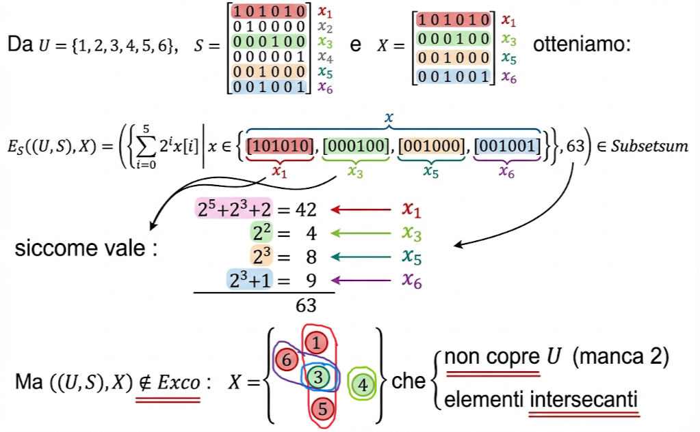
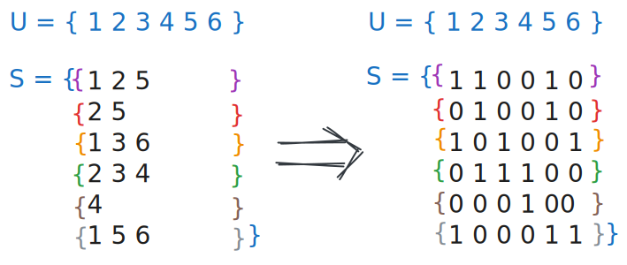

<!-- _class: titlepage -->

 

Riduzione $EXCO \le_p Subsetsum$

 Aspetti fondamentali relativi alla riduzione di EXCO a Subsetsum
 

 Gabriele Brizio 

 Domanda 2.6 

 Algoritmi e Complessità 

---

# Riduzione $EXCO \le_p SUBSETSUM$

Obiettivo: trasformare un’istanza $E = (U, S)$ di **EXact COver**   in un’istanza $(W, C)$ di **SUBSETSUM** tale che:

**$E \in EXCO$ ⇔ $W$ contiene un sottoinsieme che somma a $C$**

---

# Struttura del problema EXCO

- $U = \{u_1, \ldots, u_m\}$  
- $S = \{S_1, \ldots, S_k\}$ con $S_i \subseteq U$

Vogliamo un sottoinsieme $S' \subseteq S$ tale che:

1. gli insiemi in $S'$ sono **disgiunti**,  
2. la loro unione è **esattamente $U$**.

---

# Intuizione: codifica binaria

Rappresentiamo ogni insieme $S_i$ come una stringa binaria:

---

$$
E_S((U,S),S') = 
\left(
  \left\{
    \sum_{i=0}^{m-1} 2^{i}\, x[i] \;\middle|\; x \in S'
  \right\},
  \; 2^{m}-1
\right)
\qquad \text{con } |U| = m .
$$

 

E l’obiettivo è sommare i $w_i$ per ottenere:

$$
C = 2^0 + 2^1 + \cdots + 2^{m-1}
$$

che rappresenta “tutti gli elementi di $U$ presi una volta”.

---

# Problema
La somma in base 2 genera "riporti": si potrebbero sommare insiemi che **non** sono disgiunti ed ottenere comunque $C$.

---

# L’idea chiave: evitare riporti

Per evitare che la somma generi riporti: **sostituiamo la base 2 con una base p sufficientemente grande.**

Se la base è maggiore della **massima sovrapposizione possibile** tra insiemi di $S$, allora:

- sommare insiemi non disgiunti produrrebbe una cifra ≥ p,  
- il che impedirebbe di ottenere esattamente il target.

---

# Come scegliere la base p

Per ogni elemento $u_j \in U$, contiamo in quanti insiemi compare:

$$
occ(u_j) = |\{\, S_i : u_j \in S_i \,\}|
$$

Sia:

$$
p = 1 + \max_j occ(u_j)
$$

Così garantiamo che **anche scegliendo tutti gli insiemi**, la somma di tutte le occorrenze per una singola colonna non supera $p-1$.

Quindi **nessun riporto può mai verificarsi**.

---

# Definizione finale di $E_s$

$$

E_s : \mathbf{Set} \times \mathbf{Set} \times \mathbf{Set}
    \longrightarrow \mathcal{P}(\mathbb{N}) \times \mathbb{N}
$$

$$
(U, S, X) \longmapsto 
\left(
  \left\{
    \sum_{i=0}^{|u|-1} p^{\,i}\, x[i] \;\middle|\; x \in X
  \right\},
  \frac{p^{\,|u|}-1}{p-1}
\right)

$$

e la somma C è:

$$
C = \sum_{j=0}^{m-1} p^{j}
= \frac{p^m - 1}{p - 1}
$$

che rappresenta l’elemento “tutti gli $x_j$ presi esattamente una volta”.

---

# Perché la somma $C$ è equivalente a $\frac{p^m-1}{p-1}$ ?

È la somma:

$$
p^{m-1} + p^{m-2} + \cdots + p^{1} + p^{0}
$$

cioè **una cifra 1 in ogni colonna** della rappresentazione in base p.

Questo rappresenta esattamente la condizione:

- ogni elemento di $U$ è coperto una sola volta.

E non ci sono "riporti" → la forma è unica.

---

# Dimostrazione

Pensiamo a $S$ come a una matrice $m \times k$, con:

- righe = elementi di $U$  
- colonne = insiemi $S_i$  

E consideriamo la sua **trasposta** $S^T$.

Sommandone le colonne in base $p$ otteniamo un vettore:

$$
v = S^T \cdot \begin{bmatrix}
p^{0} \\ p^{1} \\ \vdots \\ p^{m-1}
\end{bmatrix}
$$

Il vettore $v$ descrive esattamente:

- quali insiemi sono stati scelti,  
- come contribuiscono alla copertura degli elementi.

---

## $(U,S) \in EXCO \Leftrightarrow E_s((U,S),S') \in Subsetsum$ (con $S'$ copertura esatta di $U$)

Il valore $\sum_{j=0}^{m-1} p^{j}$ si ricava sommando gli $m$ elementi del vettore ottenuto dal prodotto:

$$
[p^{m-1}...p^0] \times S^T
$$

se e solo se:
**1)** $\forall 1 \le i \le m \;\;\;(\exists 0 \le j \le m-1: d_{ji}=1) \Rightarrow \forall 1 \le k \le n\;\;\; d_{jk}=0$

**2)** $\forall 0 \le j \le m-1\;\;\;\exists\, 1 \le i \le n\;\;\; d'_{ji}=1$

---

## Ossia...

La somma in base $p$ è **esatta** (nessun riporto) se e solo se:

1. **Disgiunzione**  
   nessun elemento $u_j$ compare in due insiemi scelti →  
   nessuna colonna contiene due “1”.

2. **Copertura**  
   ogni $u_j$ è coperto almeno una volta →  
   nessuna colonna dell’assegnazione è tutta zero.

Queste sono esattamente le condizioni di EXCO.

---

# Conclusione

Costruire la base $p$ e i numeri $w_i$ richiede tempo polinomiale.

### **Conclusione**
$$
EXCO \le_p SUBSETSUM
$$

La riduzione è corretta e polinomiale.
