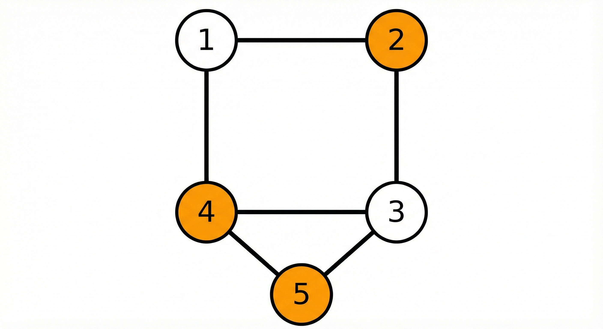
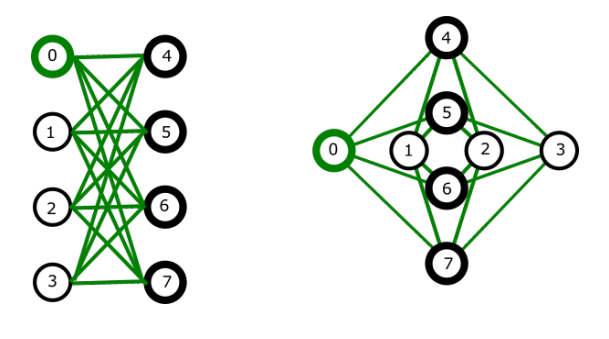

<!-- _class: titlepage -->

 

Modelli Quadratici e Riduzioni a QUBO

 Aspetti fondamentali relativi alle riduzioni R1 MVC ≤ QUBO e R2 PLI ≤ QUBO
 

 Gabriele Brizio 

 Domanda 3.1 

 Algoritmi e Complessità 

---

# Obiettivo

Analizzare come problemi di ottimizzazione classica possano essere mappati in modelli **QUBO** per essere risolti su architetture come D-Wave.

Il modello QUBO richiede di trovare il vettore binario $x^*$ che minimizza l'energia del sistema:

$$ \min_{x \in \{0,1\}^n} x^T Q x $$

Dove $Q$ è una matrice (triangolare superiore o simmetrica) che codifica:
- **Diagonale:** Pesi lineari (bias dei qbit).
- **Fuori diagonale:** Interazioni tra variabili (accoppiatori).

---

# Strategia generale di riduzione

La maggior parte dei problemi NP-hard ha vincoli rigidi (es. "devi coprire tutti gli archi"). Poiché QUBO è "unconstrained" (senza vincoli espliciti), utilizziamo il metodo delle **Penalità**:

$$ H_{totale} = H_{obiettivo} + \lambda \cdot H_{penalità} $$

1. **$H_{obiettivo}$**: Codifica la funzione di costo originale.
2. **$H_{penalità}$**: Vale 0 se il vincolo è rispettato, $>0$ se violato.
3. **$\lambda$ (Lagrangiano)**: Un valore scalare che bilancia i due termini.

---

# Riduzione $MVC \le_p CUBO$
### Dai vincoli geometrici alle penalità energetiche

---

# Definizione di MVC: Minimum Vertex Cover 

Dato un grafo $G=(V, E)$, cercare il sottoinsieme di vertici $C \subseteq V$ di cardinalità minima tale che ogni arco $(i, j) \in E$ sia incidente ad almeno un vertice in $C$.

**Variabili binarie:**
Per ogni nodo $i$, definiamo $v_i$:
- $v_i = 1$ se il nodo è nella copertura.
- $v_i = 0$ altrimenti.

---

# Modellazione QUBO di MVC

Il problema ha due componenti:

1. **Minimizzazione (Obiettivo):** Vogliamo usare meno nodi possibile.
   $$ \min \sum_{i=1}^{|V|} v_i $$

2. **Vincolo (Copertura):** Per ogni arco $(i, j)$, almeno uno dei due nodi deve essere scelto.
   $$ v_i + v_j \ge 1 \quad \forall (i,j) \in E $$

Come trasformiamo la disuguaglianza $v_i + v_j \ge 1$ in una penalità quadratica?

---

# La funzione di penalità per l'arco

Trasformiamo il vincolo in un polinomio che vale 0 solo se $v_i$ o $v_j$ (o entrambi) sono 1.

$$ P_{(i,j)} = 1 - v_i - v_j + v_i v_j $$

**Analisi dei casi:**
| $v_i$ | $v_j$ | Coperto? | Valore Penalità $P$ |
|---|---|---|---|
| 0 | 0 | **No** | $1 - 0 - 0 + 0 = \mathbf{1}$ (Penalità!) |
| 1 | 0 | Sì | $1 - 1 - 0 + 0 = \mathbf{0}$ |
| 0 | 1 | Sì | $1 - 0 - 1 + 0 = \mathbf{0}$ |
| 1 | 1 | Sì | $1 - 1 - 1 + 1 = \mathbf{0}$ |

---

# L'Importanza del Lagrangiano $\lambda$

L'Hamiltoniana finale è:
$$ H(v) = \sum_{i=1}^{|V|} v_i + \lambda \sum_{(i,j) \in E} (1 - v_i - v_j + v_i v_j) $$

**Punto Critico:** Se $\lambda$ è troppo piccolo (es. $\lambda = 1$), il sistema potrebbe preferire **non coprire** un arco per risparmiare il costo del nodo.
> *Esempio:* Non coprire un arco costa +1 di penalità, ma risparmiare un nodo guadagna -1 nell'obiettivo. Bilancio netto 0. Soluzione non valida!

**Soluzione:** Impostare $\lambda > 1$ (tipicamente $\lambda \ge 2$) per rendere la violazione del vincolo energeticamente sconveniente rispetto all'aggiunta di un nodo.

---

# Riduzione $PLI \le_p CUBO$
### Gestire disuguaglianze generiche e variabili slack

---

# Il problema PLI

La Programmazione Lineare Intera cerca di minimizzare un polinomio lineare soggetto a vincoli del tipo:

$$ C(x_1, ..., x_n) \le W $$

**La Sfida:**
A differenza di MVC (dove il vincolo era specifico sugli archi), qui abbiamo disuguaglianze generiche (es. Problema dello Zaino/Knapsack).
QUBO accetta solo equazioni (minimizzazione), non disuguaglianze dirette.

---

# Riduzione tramite variabili slack

Per convertire la disuguaglianza in uguaglianza, introduciamo una **variabile di scarto (slack variable)** $S$:

$$ \sum a_i x_i \le W \quad \Longrightarrow \quad \sum a_i x_i + S = W $$

La penalità quadratica diventa quindi il quadrato della differenza:

$$ H_{penalità} = \left( \sum a_i x_i + S - W \right)^2 $$

Minimizzare questo termine a 0 garantisce il rispetto dell'equazione.

---

# Codifica binaria delle slack variables

La variabile $S$ è un numero intero ($0 \le S \le W$), ma la QPU lavora con qbit ($0, 1$). Dobbiamo usare l'espansione binaria:

$$ S = \sum_{k=0}^{\lfloor \log_2 W \rfloor} 2^k y_k $$

Dove $y_k$ sono nuove variabili binarie ausiliarie aggiunte al sistema.

**Costo della riduzione:**
Questa tecnica aumenta il numero di qbit necessari, rendendo più complesso il *minor-embedding* sul chip fisico (mappatura del grafo logico sul grafo Chimera/Pegasus).

---

# Conclusioni e Workflow D-Wave

1. **Analisi:** Identificare obiettivo e vincoli.
2. **Riduzione:**
   - MVC: Vincoli logici $\to$ Penalità dirette con $\lambda$ tarato.
   - PLI: Disuguaglianze $\to$ Variabili Slack $\to$ Espansione Binaria.
3. **Implementazione:** Definizione della matrice $Q$ (o dizionario Python) usando l'SDK `Ocean`.
4. **Risoluzione:** Invio al `DWaveSampler` (Quantum) o `SimulatedAnnealingSampler` (Classico).
