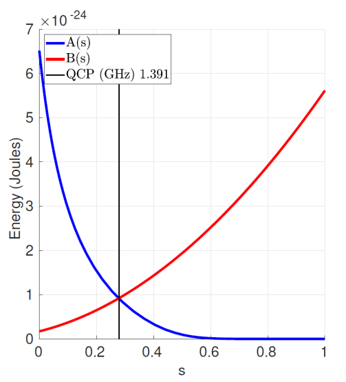
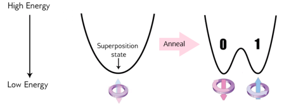

<!-- _class: titlepage -->

 

Quantum Annealing e Simulated Annealing

 Confronto tra meta-euristica classica e fenomeno quantistico
 

 Gabriele Brizio 

 Domanda 3.2 

 Algoritmi e Complessità 

---

# Obiettivo del confronto

Analizzare la relazione tra:
1. **Simulated Annealing (SA):** Una meta-euristica classica eseguita su architetture standard (von Neumann)
2. **Quantum Processing Unit (QPU):** Un dispositivo fisico che computa sfruttando il fenomeno del Quantum Annealing (QA)

### Punto di contatto:
Entrambi i metodi cercano il minimo globale in un **Energy Landscape** complesso (spazio delle soluzioni), ma utilizzano meccanismi fisici e matematici radicalmente diversi per esplorarlo ed evitare i minimi locali

---

# Simulated Annealing (SA)
### L'analogia termica

Il SA simula il processo di raffreddamento lento di un metallo (ricottura) per raggiungere una struttura cristallina ordinata (minima energia).

Il meccanismo è un **random walk** (cammino casuale) nello spazio degli stati:
*   Esiste una "Temperatura" $T$ che decresce nel tempo ($T \to 0$).
*   Se un vicino $n$ migliora l'energia ($E(n) < E(x)$), viene accettato.
*   Se $n$ peggiora l'energia ($E(n) > E(x)$), può essere comunque accettato con probabilità:
    $$ P = e^{-\frac{E(n)-E(x)}{t}} $$

**Scopo:** Accettare stati peggiori permette di "risalire la collina" per uscire da minimi locali.

---

# QPU & Quantum Annealing (QA)
### Computazione-come-Hamiltoniana

In una QPU, il calcolo non è un algoritmo discreto, ma l'evoluzione fisica di un sistema descritto da una **Hamiltoniana** dipendente dal tempo $t \in [0, 20\mu s]$:

$$ H(t) = A(t) \cdot H_{init} + B(t) \cdot H_{problem} $$

*   $H_{init}$ (Tunneling): Crea uno stato di **superposition** equiprobabile (tutti gli stati sovrapposti).
*   $H_{problem}$ (Problema): Codifica il problema (es. QUBO/Ising) e definisce il panorama energetico finale.
*   $A(t)$ e $B(t)$: Funzioni di controllo  che gestiscono la transizione.

---

# L'evoluzione dell'annealing quantistico

Al tempo $t=0$, domina $A(t)$: il sistema è in uno stato "neutro" e delocalizzato (sovrapposizione quantistica).

Al tempo $t=fine$, domina $B(t)$: il sistema collassa in uno stato classico (bit 0 o 1) che rappresenta la soluzione.

---

# Differenze: superamento delle barriere

---

### Thermal Jump vs. Quantum Tunneling
Come fa il sistema a sfuggire a un minimo locale (una "buca" nell'energy landscape) per raggiungere il minimo globale?

| Simulated Annealing (Classico) | Quantum Annealing (QPU) |
| :--- | :--- |
| **Salto Termico:** Deve avere abbastanza energia ("temperatura") per scavalcare la barriera di potenziale. | **Tunneling Quantistico:** Attraversa la barriera "passandoci attraverso". La probabilità di tunneling dipende dall'ampiezza e non (solo) dall'altezza della barriera. |
| Lento su barriere alte e strette. | Efficace su barriere alte e strette ("spikes"). |

---

# Differenze: esplorazione dello spazio
### Random Walk vs. Superposition

**Simulated Annealing:**
Processo sequenziale. Esamina un vicino alla volta. Il "punto" che esplora il grafico si muove passo dopo passo.

**Quantum Annealing:**
Processo parallelo (intrinseco). Grazie alla superposition (sovrapposizione), lo stato iniziale del sistema (definito da $H_{init}$) "occupa" simultaneamente tutti i possibili stati con equa probabilità.

#### L'evoluzione simultanea di $n$ qbit fortemente connessi esplora $2^n$ configurazioni classiche.

---

# Relazione formale SA - QA

Possiamo vedere il SA come una simulazione "semplificata" del QA:

1.  **Inizializzazione:**
    *   QA: $H_{init}$ pone il sistema in sovrapposizione equiprobabile ($1/\sqrt{2^n}$ ampiezza per ogni stato).
    *   SA: La scelta casuale del nodo di partenza approssima questa equiprobabilità.

2.  **Evoluzione:**
    *   QA: Transizione fluida guidata da $A(t)$ e $B(t)$.
    *   SA: Random walk sul grafo completo degli stati. Il decrescere della temperatura $T$ simula la dominanza progressiva di $H_{problem}$ su $H_{init}$.

---

# Implementazione pratica (Ocean SDK)

Dal punto di vista dello sviluppatore, la differenza è astratta dal framework D-Wave Ocean. Lo stesso modello **BQM** (Binary Quadratic Model) può essere risolto da entrambi:

*   **`SimulatedAnnealingSampler`:** Esegue l'algoritmo classico (CPU). Utile per debug e confronto.
*   **`DWaveSampler`:** Invia il problema alla QPU fisica (Quantum). Sfrutta il minor-embedding per mappare il grafo logico sui qbit fisici.

I risultati sono confrontabili in termini di energia minima trovata, ma ottenuti attraverso processi fisici totalmente diversi.

---

# Conclusioni

**SA** è una euristica che sfrutta il "rumore termico" simulato per non rimanere "intrappolati".

**QA** sfrutta la meccanica quantistica (Tunneling + Superposition) per filtrare lo spazio delle soluzioni.

La QPU opera come un "setaccio": parte da tutto lo spazio possibile e, attraverso il controllo dei campi magnetici ($H_{problem}$), rende progressivamente più probabili gli stati a bassa energia.